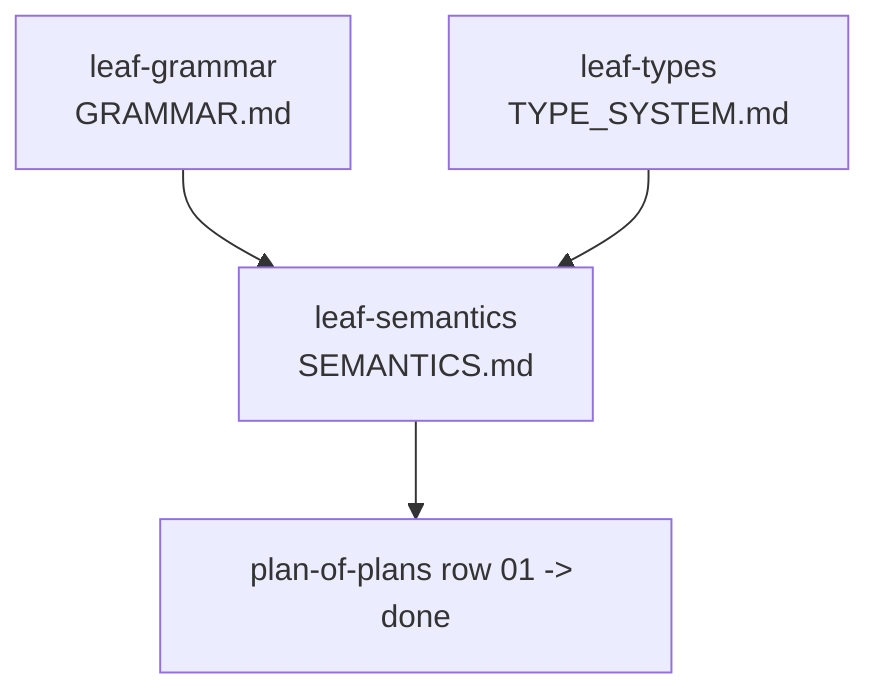
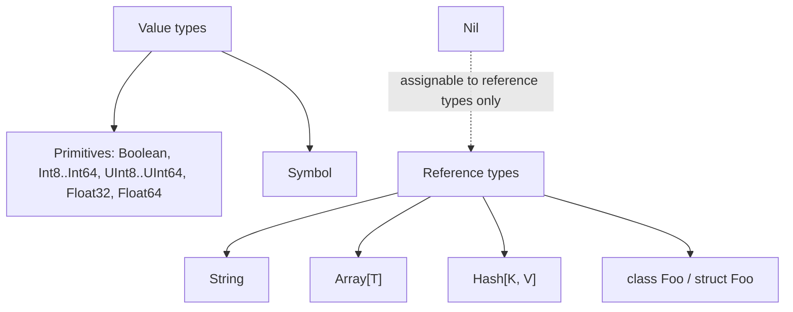
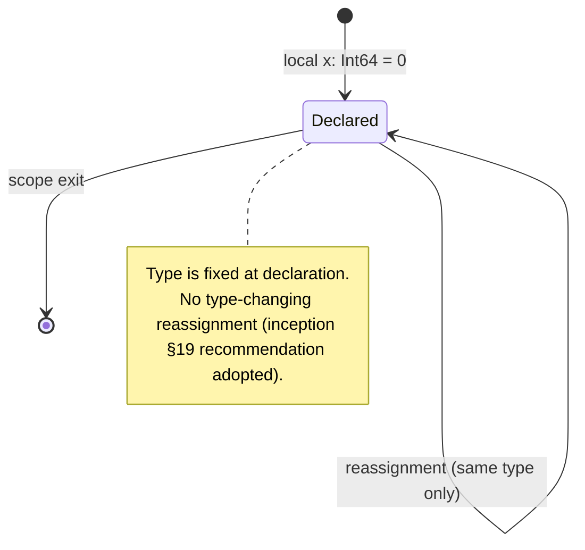

2026-09-08T17:49:41Z

Snapshot of `.cursor/plans/spec-foundations.plan.md` — plan `01
spec-foundations` from
[`plan-of-plans`](./2026-09-08T174011Z-plan-of-plans.md) — captured before
execution began.

---
name: Spec Foundations — GRAMMAR.md, SEMANTICS.md, TYPE_SYSTEM.md
overview: Author the three specification documents every later Emerald milestone depends on, resolving inception's open semantic questions before any parser/compiler code is written.
maestro:
  mission_id: null
  spec_path: null
  execution_overlay: null
todos:
  - id: leaf-grammar
    content: Author spec/GRAMMAR.md — Ruby grammar inventory marked KEEP/MODIFY/REMOVE/UNDECIDED
    status: pending
  - id: leaf-types
    content: Author spec/TYPE_SYSTEM.md — primitive/container/user-defined type universe
    status: pending
  - id: leaf-semantics
    content: Author spec/SEMANTICS.md — resolve inception §19 open semantic questions
    status: pending
isProject: false
---

# Plan 01 — Spec Foundations

This is `spec-foundations`, row `01` of
[`history/2026-09-08T174011Z-plan-of-plans.md`](../../history/2026-09-08T174011Z-plan-of-plans.md),
implementing inception §4, §19, §25.A–C.

## Deviation note (tracker-unavailable fallback)

No Maestro mission/task is materialized for this plan (`mission_id: null`).
This is a deliberate, disclosed deviation, not an oversight: this is the
project's first plan, written before any spec exists for `maestro spec
validate` to check against, and the work is docs-only with no code surface
for a wave table to protect. Waves below are tracked in this plan file and
the plan-of-plans row instead. Follow-up plans should materialize normally
once `.maestro/specs/` has real spec content to seed from.

## Executive summary

Emerald's inception document (§4) requires the language to be defined before
it is implemented, and explicitly warns against letting the first compiler
accidentally become the specification. This plan produces the three
foundational spec documents — `GRAMMAR.md`, `TYPE_SYSTEM.md`, `SEMANTICS.md`
— that every later milestone (lexer/parser, type checker, codegen, classes,
collections, exceptions) must conform to. It resolves every open question
listed in inception §19 with an explicit, justified decision, and produces a
graded Ruby-grammar inventory rather than inventing syntax ad hoc. No
compiler code is touched; this plan is spec-only, matching PLAN-mode write
rules.

## Decision log

- **Lane:** `normal` — docs-only, no code, low risk, but three interlocking
  documents wide enough to warrant a real plan rather than an inline note.
- **Scope lock:** produce `spec/GRAMMAR.md`, `spec/TYPE_SYSTEM.md`,
  `spec/SEMANTICS.md` only. `RUNTIME.md` and `COMPILER.md` (also named in
  §4) are out of scope — they depend on toolchain decisions from plan `02
  toolchain-prototype`, which has not run yet.
- **Placement:** `spec/` (per inception §16's proposed workspace layout),
  created now rather than deferring to `03 workspace-bootstrap`, since these
  three files have no dependency on the Cargo workspace scaffold.
- **Write order:** GRAMMAR → TYPE_SYSTEM → SEMANTICS. Semantics decisions
  (e.g. "are local variables mutable by default") are stated in terms of
  grammar productions and named types, so both must exist first even though
  all three are authored by the same single writer in this plan (no
  cross-leaf parallelism available — see Parallelism map below).

## Dependency graph



## Parallelism map

Single writer, single session — no concurrent subagents dispatched. The wave
table below records dependency order for auditability, not concurrency:

| Wave | Leaf | Parallel? | Blocked by |
|------|------|-----------|------------|
| 0 | leaf-grammar, leaf-types | conceptually yes, executed sequentially | — |
| 1 | leaf-semantics | no | leaf-grammar, leaf-types |

---

## Leaf: leaf-grammar

### 1. Context
- Why: inception §18 requires importing Ruby's grammar as an inventory and
  marking each production KEEP/MODIFY/REMOVE/UNDECIDED rather than
  reinventing syntax from memory. Without this, later parser work has no
  ground truth for what Emerald source code looks like.
- Current state: no `spec/` directory exists yet (verified — repo root
  listing has no `spec/`). Inception §5 already lists a first-pass
  keep/remove split at the *feature* level; this leaf raises that to the
  *grammar-production* level.
- Target state: `spec/GRAMMAR.md` covering literals, assignment, method
  definitions/calls, classes/modules, conditionals, loops, `case`, blocks,
  exceptions, operators/precedence, and basic pattern matching, each entry
  tagged and justified in one line.
- Dependencies: none.
- Maestro: intended slug `leaf-grammar`, wave 0, no parallel group (single
  writer).

### 2. Acceptance Criteria
1. `spec/GRAMMAR.md` exists and every section from inception §5's "keep /
   investigate first" list has a corresponding grammar entry.
2. Every entry in inception §5's "remove from initial language" list appears
   explicitly marked REMOVE with a one-line reason (not silently omitted).
3. Each grammar entry states KEEP, MODIFY, or REMOVE (UNDECIDED is allowed
   only where inception §19 leaves the question open, and must link to the
   matching SEMANTICS.md question).
4. At least one worked example per KEEP/MODIFY category shows Emerald
   surface syntax (not bare Ruby), consistent with the `a: Int64 -> Int64`
   style already used in inception §6.
5. The document does not introduce Rust- or Java-style syntax not already
   implied by inception (violates §2.2).

### 3. File & Module Structure
- **Create:** `spec/GRAMMAR.md`
- No modify/delete — first document in a new `spec/` directory.

### 4. Diagrams
Not applicable — this leaf produces a grammar inventory table, not
control flow.

### 5. Quality Gates
| Gate | Command | Pass | Witness level |
|------|---------|------|---------------|
| Self-review | scrutinize checklist (AC 1–5 above) | all AC met | agent-claimed-locally |
| Cross-reference | grep `spec/GRAMMAR.md` against inception §5 keep/remove lists | zero unaccounted items | agent-claimed-locally |

### 6. Implementation Notes
- Follow the KEEP/MODIFY/REMOVE/UNDECIDED format inception §18 itself
  demonstrates for `CALL`.
- Do not transcribe Ruby's full `parse.y` — inception §5/§17 explicitly
  scope v1 down to a small subset; the inventory should match that subset
  plus the near-term milestones in §17 (control flow, classes), not every
  Ruby corner case (refinements, `ObjectSpace`, etc. stay REMOVE/out of
  scope with a one-line reason, not silently absent).

### 7. Risks & Rollback
- Risk: grammar decisions made here lock in surface syntax that later
  leaves depend on. Mitigation: this is a spec document, not code — wrong
  calls are a diff, not a migration. Revert by editing the file.

---

## Leaf: leaf-types

### 1. Context
- Why: inception §7 lists a candidate primitive/container type universe but
  explicitly says "do not automatically assume Ruby's arbitrary-precision
  Integer semantics" and flags the `Integer` question as one to resolve
  deliberately, not accidentally.
- Current state: no type system document exists.
- Target state: `spec/TYPE_SYSTEM.md` defining the full v1 type universe
  (primitives, containers, user-defined), assignability/conversion rules,
  and the `Integer` machine-vs-arbitrary-precision decision.
- Dependencies: none (does not require GRAMMAR.md, though it uses the same
  `a: Int64` annotation style already fixed by inception §6).
- Maestro: intended slug `leaf-types`, wave 0.

### 2. Acceptance Criteria
1. `spec/TYPE_SYSTEM.md` defines every primitive type listed in inception
   §7 (`Boolean` through `Void`) plus `Array[T]`/`Hash[K, V]` and
   user-defined `class`/`struct`.
2. The document makes an explicit, justified decision on whether `Integer`
   is arbitrary-precision or a machine-int alias (inception §7 flags this
   as open) — no restatement of the question without an answer.
3. Numeric conversion rules are stated (what implicitly converts, e.g.
   `Int32` → `Int64`, and what requires an explicit cast).
4. `nil`/`Nil` typing is defined consistently with whatever
   `SEMANTICS.md`'s nil section will need (this leaf commits to a shape;
   leaf-semantics must not contradict it without editing this file too).
5. Collection representation follows inception §10/§11: the document states
   that `Array[Int64]` etc. must have an unboxed/packed representation path,
   not merely permit one.

### 3. File & Module Structure
- **Create:** `spec/TYPE_SYSTEM.md`

### 4. Diagrams


### 5. Quality Gates
| Gate | Command | Pass | Witness level |
|------|---------|------|---------------|
| Self-review | scrutinize checklist (AC 1–5) | all AC met | agent-claimed-locally |
| Consistency | cross-read against spec/GRAMMAR.md type-annotation examples | no contradiction | agent-claimed-locally |

### 6. Implementation Notes
- Resolve the `Integer` question by asking inception's own governing
  question (§9, §2.2): what's the smallest modification to Ruby that keeps
  native performance? A machine-int default keeps codegen simple (inception
  §11's numeric-performance goal); arbitrary precision as a *named*
  opt-in type (not the literal default) satisfies both goals without
  reopening boxing/dispatch costs by default.

### 7. Risks & Rollback
- Risk: the `Integer` decision is the single most consequential type-system
  call in this leaf — wrong here ripples into codegen much later. Mitigate
  by stating the rationale inline so it can be revisited with context,
  not just the conclusion.

---

## Leaf: leaf-semantics

### 1. Context
- Why: inception §19 lists ten open-question groups (variables, nil,
  methods, classes, blocks, arrays, exceptions, numeric types, strings,
  modules) and says explicitly these decisions "belong in SEMANTICS.md, not
  scattered throughout compiler code."
- Current state: none of the ten question groups are answered anywhere in
  the repo.
- Target state: `spec/SEMANTICS.md` with one section per inception §19
  group, each posed question answered as a numbered decision with a
  one-line rationale tied back to inception's stated philosophy (§2.2 "no
  Rust-flavoring", §9 "no duck typing in v1", §12 "no ownership system
  preemptively").
- Dependencies: `leaf-grammar` (semantics is stated over grammar
  productions), `leaf-types` (semantics references named types directly,
  e.g. "locals are statically typed at declaration, matching
  TYPE_SYSTEM.md's `Nil`-assignability rule").
- Maestro: intended slug `leaf-semantics`, wave 1, blocked by leaf-grammar
  and leaf-types.

### 2. Acceptance Criteria
1. `spec/SEMANTICS.md` has one section per inception §19 group (Variables,
   Nil, Methods, Classes, Blocks, Arrays, Exceptions, Numeric types,
   Strings, Modules) — no group silently dropped.
2. Every question inception §19 poses under each group is answered with a
   decision, not restated as still-open (e.g. "Are local variables mutable
   by default?" gets a yes/no, not a discussion).
3. Where inception offers a recommendation (e.g. §19 Variables: "Can
   variables change type after initialization? (Recommended: no.)"), the
   decision either adopts it explicitly or states why it deviates.
4. No decision contradicts a KEEP/MODIFY choice already made in
   `spec/GRAMMAR.md` or a type defined in `spec/TYPE_SYSTEM.md`.
5. No decision reintroduces anything from inception §20's out-of-scope list
   (metaprogramming, `method_missing`, monkey patching, etc.).

### 3. File & Module Structure
- **Create:** `spec/SEMANTICS.md`

### 4. Diagrams


### 5. Quality Gates
| Gate | Command | Pass | Witness level |
|------|---------|------|---------------|
| Self-review | scrutinize checklist (AC 1–5) | all AC met | agent-claimed-locally |
| Coverage | line-by-line match against inception §19's ten groups | 10/10 covered | agent-claimed-locally |
| Scope | line-by-line match against inception §20's out-of-scope list | 0 reintroduced | agent-claimed-locally |

### 6. Implementation Notes
- Keep each decision to a numbered "must" statement plus one rationale
  line — inception's own writing style (§9, §11) is terse and declarative;
  match it rather than writing prose essays per question.
- Where a decision has a natural knock-on effect on a later milestone
  (e.g. "exceptions use native unwinding" affects `11 exceptions` in
  plan-of-plans), note it in one line so the later plan inherits context
  without re-deriving it.

### 7. Risks & Rollback
- Risk: this is the highest-leverage document in the plan — every later
  milestone in plan-of-plans reads it. Mitigate by requiring AC 4 (no
  contradiction with the other two leaves) as a hard gate, not a
  suggestion.

---

## Total quality gate

```bash
test -f spec/GRAMMAR.md && test -f spec/TYPE_SYSTEM.md && test -f spec/SEMANTICS.md
```
Plus the per-leaf self-review/coverage/consistency checks above. No
build/test/lint commands apply — this plan produces no code.

## Out of scope / deferred

- `spec/RUNTIME.md`, `spec/COMPILER.md` (inception §4) — deferred to after
  `02 toolchain-prototype` picks concrete crates.
- Any parser/compiler code — that is `04 milestone1-front-end` onward.
- Live Maestro mission/task materialization — see Deviation note above.

## Maestro artifacts produced

None (see Deviation note). On completion, update
`history/2026-09-08T174011Z-plan-of-plans.md` row `01` to `done` and record
this plan's history-document copy path as the audit trail.
