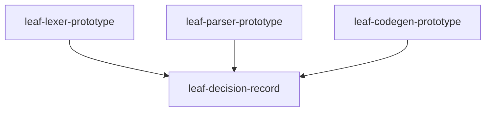
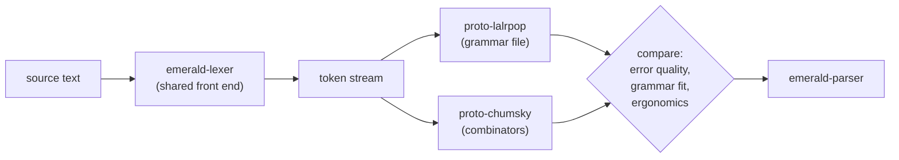
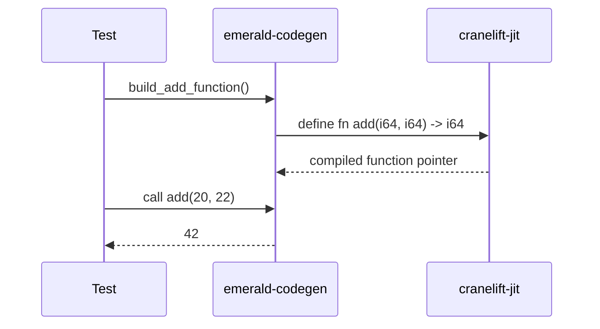

2026-09-08T18:04:19Z

Snapshot of `.cursor/plans/toolchain-prototype.plan.md` — plan `02
toolchain-prototype` from
[`plan-of-plans`](./2026-09-08T174011Z-plan-of-plans.md) — captured before
execution began.

---
name: Toolchain Prototype
overview: Prototype and select the lexer, parser, and codegen crates inception §14/§23 name as candidates, deciding before committing to any of them permanently.
maestro:
  mission_id: null
  spec_path: null
  execution_overlay: null
todos:
  - id: leaf-lexer-prototype
    content: Prototype crates/emerald-lexer with logos, tokenizing examples/hello.em's source
    status: pending
  - id: leaf-parser-prototype
    content: Prototype the add() function grammar with both LALRPOP and chumsky, decide, keep the winner as crates/emerald-parser
    status: pending
  - id: leaf-codegen-prototype
    content: Prototype crates/emerald-codegen with Cranelift, JIT-compile and run add(20, 22) -> 42
    status: pending
  - id: leaf-decision-record
    content: Record all three decisions with rationale in spec/COMPILER.md
    status: pending
isProject: false
---

# Plan 02 — Toolchain Prototype

This is `toolchain-prototype`, row `02` of
[`plan-of-plans`](../../history/2026-09-08T174011Z-plan-of-plans.md),
implementing inception §14, §23.

## Deviation note

**Codegen comparison is asymmetric, disclosed up front.** Inception §14.6
asks for a Cranelift-vs-Inkwell comparison before committing "permanently."
This environment has no `llvm-config` and no `LLVM_SYS_*_PREFIX` wired
(verified: `llvm-config` is not on `PATH`; the Nix store holds only an
unbuilt `llvm-19.1.7.drv` and an `llvm-19.1.7-lib` output, not a usable
`llvm-config` binary). Standing up a working Inkwell build means adding
LLVM to the shared `devenv.nix` — a repo-environment change with a much
larger blast radius than a single crate prototype, and out of scope for
this plan to make unilaterally. Per inception §14.6's own text — "Prototype
Emerald code generation with Cranelift first if rapid implementation is the
priority" — this plan prototypes Cranelift only, ships it as the v1
codegen backend, and records the LLVM comparison as explicitly deferred
future work with the concrete trigger condition for revisiting it (§14.6's
"permanently" qualifier is honored: this is a v1 decision, not a permanent
one).

## Executive summary

This plan makes the three toolchain decisions inception §14/§23 flag as
needing prototyping before commitment: lexer (logos — inception names no
alternative, so this leaf is a feasibility check, not a comparison), parser
(LALRPOP vs chumsky, a real comparison against the same grammar slice), and
codegen (Cranelift, with Inkwell explicitly deferred per the Deviation
note). Each decision is backed by working code that lexes/parses/compiles
inception §17's first milestone snippet, not by research alone. The losing
parser prototype is not kept in the tree (inception §22 rule 9/10: keep the
project small) — its code and comparison evidence are preserved in this
plan's history snapshot and the decision record.

## Dependency graph



## Parallelism map

| Wave | Leaf | Parallel? | Blocked by |
|------|------|-----------|------------|
| 0 | leaf-lexer-prototype, leaf-parser-prototype, leaf-codegen-prototype | independent, executed sequentially by one writer | — |
| 1 | leaf-decision-record | no | all three wave-0 leaves |

---

## Leaf: leaf-lexer-prototype

### 1. Context
- Why: inception §14.2 names `logos` as the lexer candidate to investigate;
  a working tokenization of a real Emerald snippet is the feasibility
  check before every later milestone depends on it.
- Current state: no lexer exists.
- Target state: `crates/emerald-lexer` tokenizes `examples/hello.em`'s
  source (once that file exists — this leaf inlines the same source as a
  test fixture, since `03 workspace-bootstrap` has not run yet in this
  reordered sequence) into the correct token stream, including the `->`
  return-type arrow and `:` type-annotation colon that `spec/GRAMMAR.md`
  §2/§6 require.
- Dependencies: none.
- Maestro: intended slug `leaf-lexer-prototype`, wave 0.

### 2. Acceptance Criteria
1. `crates/emerald-lexer` is a workspace member and `cargo build -p
   emerald-lexer` succeeds.
2. A test tokenizes the exact source `def add(a: Int64, b: Int64) ->
   Int64\n  a + b\nend\n\nputs add(20, 22)\n` and asserts the full token
   sequence (kind + text) matches expectations, including `Def`, `Ident`,
   `LParen`, `Colon`, `Arrow`, `Plus`, `Int` literal, `Puts`/`Ident`, etc.
2. A second test asserts a lexer error (not a panic) on an invalid token
   (e.g. a bare `@@` — removed per `spec/GRAMMAR.md` §2 — or an unterminated
   string).

### 3. File & Module Structure
- **Create:** `crates/emerald-lexer/Cargo.toml`, `crates/emerald-lexer/src/lib.rs`
- **Modify:** root `Cargo.toml` (`members` gains `crates/emerald-lexer`)

### 4. Diagrams
Not applicable — single-pass tokenization, no branching control flow worth
diagramming at prototype scope.

### 5. Quality Gates
| Gate | Command | Pass | Witness level |
|------|---------|------|---------------|
| Build | `cargo build -p emerald-lexer` | exit 0 | agent-claimed-locally |
| Test | `cargo test -p emerald-lexer` | all pass | agent-claimed-locally |

### 6. Implementation Notes
- Token kinds should map directly onto `spec/GRAMMAR.md`'s grammar areas
  (keywords `def`/`end`/`if`/`class`/... from the KEEP rows; punctuation
  `->`/`:`/`?` from the MODIFY rows) so later parser work has a stable
  vocabulary to build on.

### 7. Risks & Rollback
- None — an isolated, additive crate.

---

## Leaf: leaf-parser-prototype

### 1. Context
- Why: inception §14.1 names both LALRPOP and Chumsky as candidates and
  explicitly asks for "a small prototype with both before committing... do
  not decide based solely on popularity."
- Current state: no parser exists.
- Target state: two throwaway prototype crates, each parsing `def
  add(a: Int64, b: Int64) -> Int64 \n a + b \n end` into the same minimal
  AST shape (function name, typed params, return type, one binary-op
  body expression); a recorded, evidence-based decision; the losing
  prototype removed from the tree, the winner kept and renamed to
  `crates/emerald-parser`.
- Dependencies: `leaf-lexer-prototype` (the parser consumes
  `emerald-lexer`'s token stream in both prototypes, so both share one
  lexing front end and differ only in the parsing layer).
- Maestro: intended slug `leaf-parser-prototype`, wave 0 (parallel with
  lexer/codegen in the abstract; executed after lexer in practice since it
  consumes the lexer crate).

### 2. Acceptance Criteria
1. Both `proto-lalrpop` and `proto-chumsky` throwaway crates build and
   parse the fixture into an equal AST for the happy path.
2. Both prototypes are exercised against one malformed input (missing
   `end`) and their error output is compared for quality (line/column
   info, message clarity) — not just "does it error."
3. The decision (which crate becomes `emerald-parser`) is justified in
   writing against at least: grammar-file-driven vs. combinator
   ergonomics, error-recovery quality, and fit with inception §18's
   "import Ruby's grammar as an inventory" strategy — not decided on
   popularity alone (inception §14.1's explicit constraint).
4. After the decision, exactly one parser crate remains in the tree
   (`crates/emerald-parser`); the other's code is not committed, but its
   comparison evidence (what it looked like, why it lost) is recorded in
   the decision record (`leaf-decision-record`) and this plan's history
   snapshot.

### 3. File & Module Structure
- **Create (prototype, later pruned to one):** `crates/proto-lalrpop/`,
  `crates/proto-chumsky/`
- **Create (final):** `crates/emerald-parser/Cargo.toml`,
  `crates/emerald-parser/src/lib.rs` (the winner, renamed)
- **Modify:** root `Cargo.toml` `members`

### 4. Diagrams


### 5. Quality Gates
| Gate | Command | Pass | Witness level |
|------|---------|------|---------------|
| Build both | `cargo build -p proto-lalrpop -p proto-chumsky` (during comparison) | exit 0 | agent-claimed-locally |
| Test winner | `cargo test -p emerald-parser` | all pass | agent-claimed-locally |
| Tree is pruned | `! test -d crates/proto-lalrpop && ! test -d crates/proto-chumsky` (after decision) | true | agent-claimed-locally |

### 6. Implementation Notes
- Keep both prototypes to the single grammar slice above — this is a
  feasibility/ergonomics comparison, not a race to implement the full
  grammar twice.
- LALRPOP requires a `build.rs` + `.lalrpop` grammar file under `grammar/`
  (inception §16 anticipates this exact path); Chumsky requires none. This
  asymmetry is itself part of the comparison, not a thumb on the scale for
  either side — record it plainly.

### 7. Risks & Rollback
- Risk: discarding the losing prototype loses runnable evidence from the
  repo itself. Mitigated by recording its full comparison (code shape,
  error output, decision rationale) in the history snapshot before
  deletion.

---

## Leaf: leaf-codegen-prototype

### 1. Context
- Why: inception §14.6 requires codegen backend evaluation before
  committing; inception §17's first milestone is exactly "compile `add`
  to a native executable that prints 42" — the smallest possible codegen
  feasibility check.
- Current state: no codegen exists.
- Target state: `crates/emerald-codegen` builds a Cranelift IR function
  equivalent to `fn add(a: i64, b: i64) -> i64 { a + b }`, JIT-compiles it,
  calls it with `(20, 22)`, and asserts the result is `42`.
- Dependencies: none (does not need the lexer/parser prototypes — this
  leaf hand-builds the IR directly, matching how a real codegen stage
  would receive an already-typed IR from `emerald-ir`, which doesn't exist
  yet).
- Maestro: intended slug `leaf-codegen-prototype`, wave 0.

### 2. Acceptance Criteria
1. `crates/emerald-codegen` is a workspace member; `cargo build -p
   emerald-codegen` succeeds without any LLVM/Inkwell dependency.
2. A test JIT-compiles the `add` function via `cranelift-jit` and asserts
   calling it with `(20, 22)` returns `42` — this is the actual "generate
   native code, execute it, print 42" proof inception §17 asks for, minus
   the parser/AST front end (that's `04`–`06`).
3. The Inkwell/LLVM path is not implemented, and the Deviation note
   explains why with a concrete, checkable claim (`llvm-config` absent),
   not a vague deferral.

### 3. File & Module Structure
- **Create:** `crates/emerald-codegen/Cargo.toml`,
  `crates/emerald-codegen/src/lib.rs`
- **Modify:** root `Cargo.toml` `members`

### 4. Diagrams


### 5. Quality Gates
| Gate | Command | Pass | Witness level |
|------|---------|------|---------------|
| Build | `cargo build -p emerald-codegen` | exit 0 | agent-claimed-locally |
| Test | `cargo test -p emerald-codegen` | `add(20, 22) == 42` | agent-claimed-locally |

### 6. Implementation Notes
- Use `cranelift-jit` for the prototype (fastest path to "call the
  generated function and check the result"); ahead-of-time object-file
  emission (`cranelift-object`) is what milestone `06` needs for a real
  linked executable — noted as follow-up, not built here.

### 7. Risks & Rollback
- Risk: Cranelift chosen without a real LLVM comparison could be wrong
  for a future milestone needing LLVM-only optimizations (e.g.
  auto-vectorization inception §11 mentions). Mitigated by the Deviation
  note's explicit revisit trigger: if a later milestone's benchmark
  (`15 benchmarking`) shows Cranelift-generated code is meaningfully
  slower than LLVM-generated code for the numeric hot paths inception §11
  cares about, re-open this decision with LLVM properly wired into
  `devenv.nix` first.

---

## Leaf: leaf-decision-record

### 1. Context
- Why: inception §4 requires specification documents, not decisions
  scattered across commit messages; `spec/COMPILER.md` is one of the six
  documents inception §4 names and was deferred from plan `01` explicitly
  pending this plan.
- Current state: `spec/COMPILER.md` does not exist.
- Target state: `spec/COMPILER.md` with a "Toolchain Decisions" section
  recording lexer/parser/codegen choices, each with rationale and a
  pointer to the crate that proves it. Full pipeline architecture
  (beyond the toolchain choice) is explicitly left for the milestone plans
  that design `emerald-driver`.
- Dependencies: `leaf-lexer-prototype`, `leaf-parser-prototype`,
  `leaf-codegen-prototype` (records their outcomes).
- Maestro: intended slug `leaf-decision-record`, wave 1.

### 2. Acceptance Criteria
1. `spec/COMPILER.md` exists with a "Toolchain Decisions" section covering
   lexer, parser, and codegen.
2. Each decision states: chosen crate, rejected alternative(s) (if any),
   and the concrete evidence (test/crate path) backing it — not just an
   assertion.
3. The document explicitly scopes itself as toolchain-only, not full
   pipeline architecture, per the Deviation note in plan `01`'s decision
   log.
4. `grammar/` (from `03 workspace-bootstrap`, not yet run) is referenced
   correctly for whichever parser wins — if LALRPOP wins, the document
   points at the real `.lalrpop` grammar file's eventual path.

### 3. File & Module Structure
- **Create:** `spec/COMPILER.md`

### 4. Diagrams
Not applicable — this leaf is a decision record, not new control flow.

### 5. Quality Gates
| Gate | Command | Pass | Witness level |
|------|---------|------|---------------|
| Self-review | scrutinize checklist (AC 1–4) | all AC met | agent-claimed-locally |

### 6. Implementation Notes
- Match the terse, numbered-decision style `spec/SEMANTICS.md` already
  established, for consistency across the spec/ directory.

### 7. Risks & Rollback
- None — a documentation leaf with no code surface.

---

## Total quality gate

```bash
cargo build -p emerald-lexer -p emerald-parser -p emerald-codegen \
  && cargo test -p emerald-lexer -p emerald-parser -p emerald-codegen \
  && test -f spec/COMPILER.md \
  && ! test -d crates/proto-lalrpop && ! test -d crates/proto-chumsky
```

## Out of scope / deferred

- Inkwell/LLVM codegen prototype — see Deviation note; revisit trigger is
  stated in `leaf-codegen-prototype`'s Risks section.
- `rowan` (lossless syntax trees), `salsa` (incremental compilation),
  `miette` (diagnostics), `id_effect` (pipeline orchestration) — inception
  §14.3/§14.4/§14.5/§15 name these as later investigations, not blockers
  for the lexer/parser/codegen feasibility this plan settles. Each gets
  evaluated when the milestone that needs it arrives (diagnostics quality
  becomes concrete at `13 diagnostics`; incremental compilation has no
  driver to incrementally compile yet).
- Ahead-of-time object-file emission / linking a real executable — that is
  `06 milestone1-codegen`'s job; this plan proves the codegen backend
  choice via JIT only.

## Maestro artifacts produced

None (see plan `01`'s Deviation note doctrine — still no spec exists yet
for `maestro spec validate` to check against).
