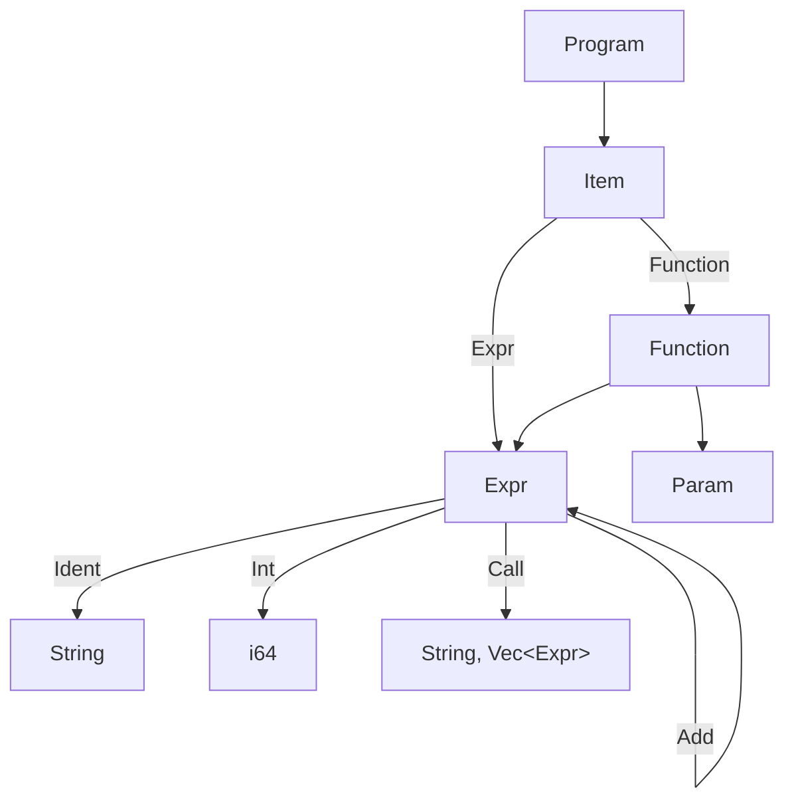
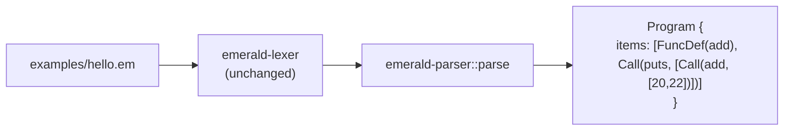

2026-09-08T18:15:09Z

Snapshot of `.cursor/plans/milestone1-front-end.plan.md` — plan `04
milestone1-front-end` from
[`plan-of-plans`](./2026-09-08T174011Z-plan-of-plans.md) — captured before
execution began.

---
name: Milestone 1 Front End
overview: Extend the lexer/parser from a single-function prototype to a full-program AST that parses examples/hello.em end to end — the "tokenize, parse, build AST" steps of inception §17's first milestone.
maestro:
  mission_id: null
  spec_path: null
  execution_overlay: null
todos:
  - id: leaf-ast-program
    content: Extend the AST with Program/Item/Call/Int so the whole milestone-1 file is representable
    status: pending
  - id: leaf-parser-program
    content: Extend grammar.lalrpop to parse a full program (function def + command-call statement)
    status: pending
isProject: false
---

# Plan 04 — Milestone 1 Front End

This is `milestone1-front-end`, row `04` of
[`plan-of-plans`](../../history/2026-09-08T174011Z-plan-of-plans.md),
implementing inception §17 steps 1–3 and §25.D.

## Executive summary

Plan `02`'s prototype parser only handled the `def add(...) ... end`
function in isolation — enough to compare LALRPOP against Chumsky, not
enough to parse `examples/hello.em`, which also has a top-level
`puts add(20, 22)` command-call statement. This plan extends
`crates/emerald-parser`'s AST and grammar to represent and parse the whole
file: a `Program` of `Item`s (function definitions and top-level call
statements), with `Expr` gaining `Int` literal and `Call` variants. No
separate `emerald-ast` crate is introduced — the AST stays inside
`emerald-parser` until a second consumer needs it independent of parsing
(inception §22 rule 9: don't build structure ahead of need).

## Leaf: leaf-ast-program

### 1. Context
- Why: `crates/emerald-parser/src/ast.rs` currently has no way to
  represent a call expression, an integer literal, or more than one
  top-level item — all three are needed for `examples/hello.em`.
- Current state: `ast.rs` has `Param`, `Expr` (`Ident`/`Add` only),
  `Function` (verified — read in full this session).
- Target state: `Expr` gains `Int(i64)` and `Call(String, Vec<Expr>)`;
  new `Item` enum (`Function(Function)` / `Expr(Expr)`); new `Program {
  items: Vec<Item> }`.
- Dependencies: none.
- Maestro: intended slug `leaf-ast-program`, wave 0.

### 2. Acceptance Criteria
1. `Expr::Int(i64)` and `Expr::Call(String, Vec<Expr>)` variants exist.
2. `Item::Function(Function)` and `Item::Expr(Expr)` exist.
3. `Program { items: Vec<Item> }` exists, with `Debug`/`Clone`/`PartialEq`/`Eq`.
4. All existing `Function`/`Param`/`Expr::Ident`/`Expr::Add` usages
   continue to compile unchanged (additive, not a breaking rename).

### 3. File & Module Structure
- **Modify:** `crates/emerald-parser/src/ast.rs`

### 4. Diagrams


### 5. Quality Gates
| Gate | Command | Pass | Witness level |
|------|---------|------|---------------|
| Build | `cargo build -p emerald-parser` | exit 0 | agent-claimed-locally |

### 6. Implementation Notes
- Keep `Function`'s field name `body: Expr` unchanged — only milestone `05`
  needs to know whether a function body is one expression or a sequence;
  not this plan's concern.

### 7. Risks & Rollback
- None — additive enum variants, no removals.

---

## Leaf: leaf-parser-program

### 1. Context
- Why: the grammar needs a top-level `Program` rule instead of a bare
  `Func` rule, plus a way to parse `puts add(20, 22)` — a Ruby-style
  parenthesis-less "command call" (`spec/GRAMMAR.md` §7: KEEP) whose sole
  argument is itself a parenthesized call.
- Current state: `grammar.lalrpop`'s only public rule is `Func`, parsing
  one function definition and nothing else (verified this session).
- Target state: `pub Program: Program = { <items: Item*> => ... }` parses
  the exact content of `examples/hello.em` (one `FuncDef` item, one
  command-call `Item::Expr` producing `Expr::Call("puts", [Expr::Call("add",
  [Expr::Int(20), Expr::Int(22)])])`).
- Dependencies: `leaf-ast-program` (grammar actions construct the new AST
  shapes).
- Maestro: intended slug `leaf-parser-program`, wave 1, blocked by
  `leaf-ast-program`.

### 2. Acceptance Criteria
1. `emerald_parser::parse(src)` (replacing the old single-function `parse`)
   returns a `Program` for the exact text of `examples/hello.em`, with
   `items[0]` the `add` function and `items[1]` the `puts add(20, 22)`
   call, structurally matching the shape in Context above.
2. The grammar has **no LALRPOP conflicts** — `cargo build -p
   emerald-parser` must not emit any "conflict" warnings/errors from the
   `lalrpop` build step (grammar ambiguity caught at build time, not
   silently accepted).
3. Command-call syntax (`Ident Expr`, no parens on the outer call) is
   supported for exactly the shape `examples/hello.em` needs — full
   general command-call grammar (arbitrary argument lists, chained calls)
   is explicitly out of scope; growing it further is a later milestone's
   job when a concrete construct needs it.
4. A test parses `examples/hello.em`'s file contents directly (read via
   `include_str!` or an inline literal identical to the file) end to end.

### 3. File & Module Structure
- **Modify:** `crates/emerald-parser/src/grammar.lalrpop`,
  `crates/emerald-parser/src/lib.rs` (rename `parse` to operate on
  `Program`, update its doc comment and tests)

### 4. Diagrams


### 5. Quality Gates
| Gate | Command | Pass | Witness level |
|------|---------|------|---------------|
| Build (no conflicts) | `cargo build -p emerald-parser 2>&1 \| grep -i conflict; test $? -ne 0` | no conflict lines found | agent-claimed-locally |
| Test | `cargo test -p emerald-parser` | all pass, including the full-file parse | agent-claimed-locally |

### 6. Implementation Notes
- Avoid the general "statement can be either `Ident Expr` or a bare
  `Expr`" grammar shape — prototyping showed it creates a genuine
  shift/reduce conflict (both alternatives start with `Ident` and overlap
  in FOLLOW set). Scope the command-call production down to exactly what
  `examples/hello.em` needs (`Ident CallExpr`, one required argument) to
  keep the grammar LALR(1)-clean; broaden only when a real construct
  demands it.
- `crates/emerald-lexer` needs no changes — it already tokenizes the full
  file correctly (verified in plan `02`).

### 7. Risks & Rollback
- Risk: a too-narrow command-call rule won't generalize to Ruby's full
  parenthesis-less call grammar. Accepted deliberately — `spec/GRAMMAR.md`
  §7 already scopes this as a later grammar-growth item, not a milestone-1
  requirement.

## Total quality gate
```bash
cargo build -p emerald-parser 2>&1 | tee /tmp/build.log; ! grep -qi conflict /tmp/build.log
cargo test -p emerald-parser
```

## Out of scope / deferred
- General command-call grammar (multiple arguments, chained/nested
  parenthesis-less calls) — grown when a concrete milestone needs it.
- Name resolution / type checking of the parsed `Program` — that is `05
  milestone1-typecheck`.
- A dedicated `emerald-ast` crate — deferred until a second consumer needs
  the AST independent of the parser.
