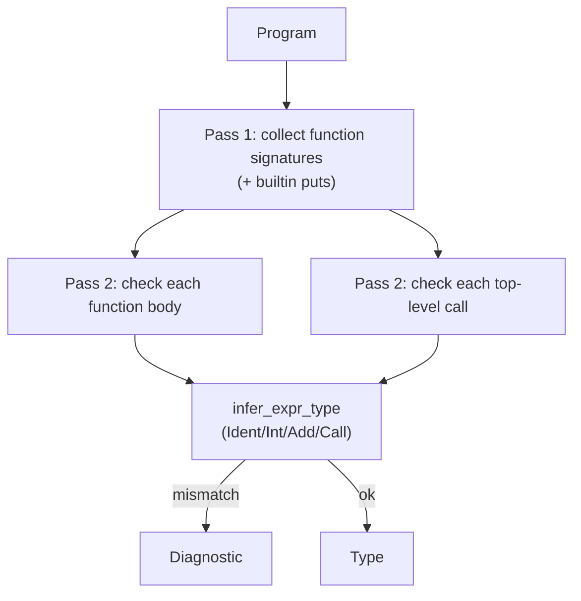

2026-09-08T18:18:15Z

Snapshot of `.cursor/plans/milestone1-typecheck.plan.md` — plan `05
milestone1-typecheck` from
[`plan-of-plans`](./2026-09-08T174011Z-plan-of-plans.md) — captured before
execution began.

---
name: Milestone 1 Typecheck
overview: Name resolution + type checking over emerald-parser's Program AST, rejecting inception §25.E's mismatched-type example with a useful diagnostic while accepting examples/hello.em.
maestro:
  mission_id: null
  spec_path: null
  execution_overlay: null
todos:
  - id: leaf-type-repr
    content: Type enum + type-name resolution against spec/TYPE_SYSTEM.md's primitives
    status: pending
  - id: leaf-checker
    content: Function-signature table, body type inference, call-site arity/type checking, diagnostics
    status: pending
isProject: false
---

# Plan 05 — Milestone 1 Typecheck

This is `milestone1-typecheck`, row `05` of
[`plan-of-plans`](../../history/2026-09-08T174011Z-plan-of-plans.md),
implementing inception §17 steps 4–7 and §25.E.

## Executive summary

New crate `crates/emerald-sema` (matching inception §16's proposed name)
type-checks an `emerald_parser::Program`: resolves each function's
parameter/return type names against `spec/TYPE_SYSTEM.md`'s primitives,
infers each function body's type, resolves call sites (including the
builtin `puts`) by name + arity + argument type per `spec/SEMANTICS.md`
§3's locked decision, and reports a diagnostic naming both types on any
mismatch — proving inception §25.E's exact example
(`def add(a: Int64, b: String) -> Int64 \n a + b \n end`) is rejected, and
`examples/hello.em` is accepted.

No separate `emerald-types` crate is introduced — the `Type` enum lives in
`emerald-sema` until a second consumer (e.g. codegen) needs it independent
of the checker (inception §22 rule 9, same reasoning as plan 04's
`emerald-ast` deferral).

## Leaf: leaf-type-repr

### 1. Context
- Why: the AST currently stores types as bare `String`s (`Param.ty`,
  `Function.return_type`); the checker needs a real `Type` value to
  compare and to reject unknown type names.
- Current state: no `emerald-sema` crate exists.
- Target state: `Type` enum covering exactly what `examples/hello.em` and
  inception §25.E's reject-case need (`Int64`, `String`, `Void`) plus a
  `resolve_type_name(&str) -> Result<Type, Diagnostic>` that errors on any
  other name — not a silent fallback, so a typo'd type name surfaces as a
  diagnostic rather than passing through unchecked.
- Dependencies: none.
- Maestro: intended slug `leaf-type-repr`, wave 0.

### 2. Acceptance Criteria
1. `Type::{Int64, String, Void}` exist; `resolve_type_name("Int64")` /
   `resolve_type_name("String")` succeed, `resolve_type_name("Bogus")`
   returns a `Diagnostic` naming the unresolved type.
2. `Diagnostic` carries a human-readable `message: String` (line/column
   spans are out of scope — `crates/emerald-lexer`/`emerald-parser` don't
   track source spans yet; adding them is a later plan's job, noted under
   Out of scope).

### 3. File & Module Structure
- **Create:** `crates/emerald-sema/Cargo.toml`, `crates/emerald-sema/src/lib.rs`
- **Modify:** root `Cargo.toml` (`members` gains `crates/emerald-sema`;
  `emerald-sema` depends on `emerald-parser` for `Expr`/`Function`/`Item`/`Program`)

### 4. Diagrams
Not applicable — a lookup table, no branching worth diagramming.

### 5. Quality Gates
| Gate | Command | Pass | Witness level |
|------|---------|------|---------------|
| Build | `cargo build -p emerald-sema` | exit 0 | agent-claimed-locally |

### 6. Implementation Notes
- Only three `Type` variants are needed for this milestone's concrete
  cases; growing the full `spec/TYPE_SYSTEM.md` primitive list happens
  when a later plan's test case needs a fourth type — not preemptively.

### 7. Risks & Rollback
- None — additive, no existing code depends on this crate yet.

---

## Leaf: leaf-checker

### 1. Context
- Why: this is the actual "reject with a useful diagnostic" requirement —
  inception §17 steps 4–7 (resolve `add`, type-check parameters, type-check
  `a + b`, determine the return type).
- Current state: no type-checking exists anywhere in the workspace.
- Target state: `check_program(&Program) -> Result<(), Vec<Diagnostic>>`
  that (a) builds a function-signature table from every `Item::Function`
  plus a builtin `puts(Int64) -> Void` entry, (b) type-checks every
  function body against its declared return type, (c) type-checks every
  top-level call expression's arguments against the resolved callee's
  signature (name + arity + argument type, per `spec/SEMANTICS.md` §3).
- Dependencies: `leaf-type-repr`.
- Maestro: intended slug `leaf-checker`, wave 1, blocked by `leaf-type-repr`.

### 2. Acceptance Criteria
1. `check_program` on `examples/hello.em`'s parsed `Program` returns `Ok(())`.
2. `check_program` on `def add(a: Int64, b: String) -> Int64 \n a + b \n end`
   (inception §25.E's exact text) returns `Err` with a message that names
   *both* offending types (`Int64` and `String`), not a generic "type
   error" — this is the "useful diagnostic" bar plan-of-plans row 05 sets.
3. An undefined-variable body (e.g. referencing a param that doesn't
   exist) produces a distinct diagnostic, not a panic.
4. An arity mismatch at a call site (e.g. calling `add` with one argument)
   produces a distinct diagnostic naming the expected vs. found count.
5. An unresolved callee name (calling an undefined function) produces a
   distinct diagnostic, not a panic — this is the "name resolution" half
   of this plan's scope, not just typing.

### 3. File & Module Structure
- **Modify:** `crates/emerald-sema/src/lib.rs`

### 4. Diagrams


### 5. Quality Gates
| Gate | Command | Pass | Witness level |
|------|---------|------|---------------|
| Test | `cargo test -p emerald-sema` | all pass, incl. reject-case + accept-case | agent-claimed-locally |
| Workspace | `cargo test --workspace` | all pass | agent-claimed-locally |

### 6. Implementation Notes
- Two-pass design (collect signatures, then check bodies) is required
  because `puts add(20, 22)`'s top-level call must resolve `add`'s
  signature, which is defined earlier in the same `Program` — a
  single-pass checker would see `puts` before `add`'s signature exists
  only if items happen to be ordered correctly; two passes make ordering
  irrelevant, matching how a real name-resolution stage behaves.
- `puts`'s builtin signature is deliberately narrow (`Int64 -> Void`) —
  matching only what `examples/hello.em` calls it with. A real `puts`
  accepting any type is a stdlib-design question for a later plan, not
  this one.

### 7. Risks & Rollback
- Risk: no source-span tracking means diagnostics are function/call-scoped
  text, not line/column-precise. Accepted for this milestone; real
  diagnostics quality is `13 diagnostics`'s job (inception §14.4).

## Total quality gate
```bash
cargo test -p emerald-sema
cargo test --workspace
```

## Out of scope / deferred
- Source-span-precise diagnostics (`miette`/`ariadne`) — `13 diagnostics`.
- A general `puts` accepting any argument type, or any other stdlib
  signature beyond this milestone's needs.
- A dedicated `emerald-types` crate — deferred until a second consumer
  needs `Type` independent of the checker.
