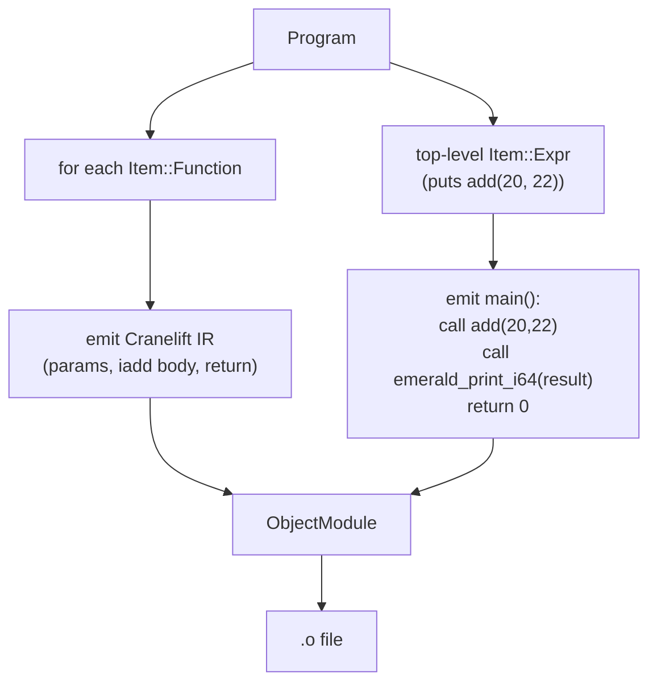
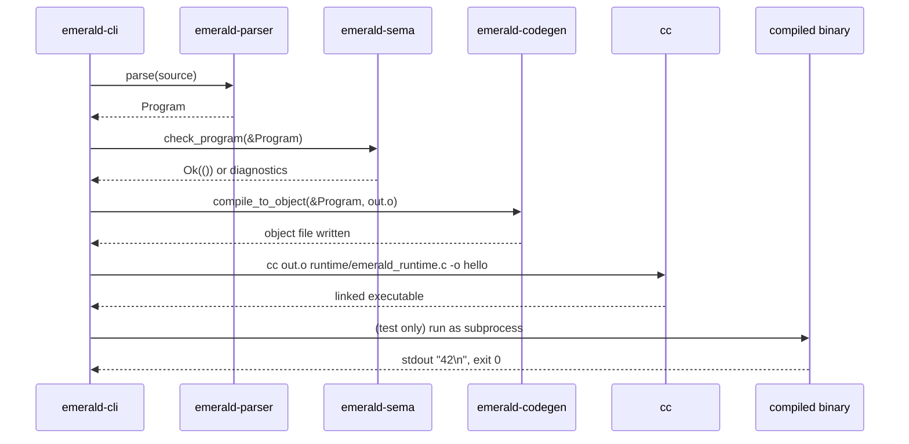

2026-09-08T18:20:56Z

Snapshot of `.cursor/plans/milestone1-codegen.plan.md` — plan `06
milestone1-codegen` from
[`plan-of-plans`](./2026-09-08T174011Z-plan-of-plans.md) — captured before
execution began.

---
name: Milestone 1 Codegen
overview: Compile examples/hello.em's real AST to a linked native executable that prints 42 when run — inception §17's own definition of "Emerald works."
maestro:
  mission_id: null
  spec_path: null
  execution_overlay: null
todos:
  - id: leaf-codegen-from-ast
    content: Extend emerald-codegen to build Cranelift IR from a real Program (not hand-built IR) and emit an object file via cranelift-object
    status: pending
  - id: leaf-runtime-shim
    content: Tiny C runtime shim (emerald_print_i64) so generated code can print without a variadic-call ABI risk
    status: pending
  - id: leaf-cli
    content: emerald-cli binary wiring parse -> typecheck -> codegen -> link -> run, with an end-to-end test asserting stdout is "42\n"
    status: pending
isProject: false
---

# Plan 06 — Milestone 1 Codegen

This is `milestone1-codegen`, row `06` of
[`plan-of-plans`](../../history/2026-09-08T174011Z-plan-of-plans.md),
implementing inception §17 steps 8–10 and §25.F — the plan-of-plans row
that completes inception's own definition of milestone 1.

## Executive summary

Plans `01`–`05` produced everything up to a type-checked AST. This plan
closes the loop: `crates/emerald-codegen` gains an ahead-of-time path that
builds Cranelift IR from a real `emerald_parser::Program` (not the
hand-built IR plan `02`'s prototype used) and emits a `.o` object file via
`cranelift-object`; a tiny C runtime shim provides the one native-runtime
function generated code needs (`emerald_print_i64`, avoiding a direct
variadic-`printf` call from Cranelift-generated code — see Decision log);
and a new `crates/emerald-cli` binary ties parse → typecheck → codegen →
system-linker invocation → execution together, with a test that actually
runs the produced executable and asserts its stdout is `42\n`. This is the
literal, executable proof of inception §17's milestone-1 definition.

## Decision log

- **Runtime shim over direct `printf` call:** Cranelift-generated code
  calling libc's variadic `printf` directly requires the caller to set up
  the System V variadic-call ABI correctly (e.g. `%al` = vector-register
  count on x86-64) — Cranelift's `call` instruction targets a fixed
  signature and does not model this. A one-function C shim
  (`emerald_print_i64(long long) -> void`, non-variadic) compiled by `cc`
  itself sidesteps the risk entirely: generated code makes an ordinary
  fixed-signature call, and the shim's own C compiler handles `printf`'s
  variadic call correctly internally.
- **No separate `emerald-driver` crate yet.** Inception §16 proposes one;
  this plan folds pipeline orchestration directly into `emerald-cli`'s
  `main.rs` since there is exactly one caller so far. Extracted to its own
  crate when a second caller (e.g. a test harness, a future language
  server) needs the same orchestration independent of argument parsing.
- **Object emission, not JIT, for the CLI path.** Plan `02`'s
  `cranelift-jit` prototype proved the codegen backend choice; inception
  §17 step 9 specifically asks for "link an executable," which needs
  `cranelift-object` + a real linker invocation, not an in-process JIT.

## Leaf: leaf-codegen-from-ast

### 1. Context
- Why: `crates/emerald-codegen` currently only builds one hand-written IR
  shape (`fn add(i64, i64) -> i64 { a + b }`, JIT-executed) from plan `02`
  — it has never read an `emerald_parser::Program`.
- Current state: `build_and_run_add` in `crates/emerald-codegen/src/lib.rs`
  ignores its AST entirely (verified this session).
- Target state: a function that takes a type-checked `Program` (i.e., one
  that already passed `emerald_sema::check_program`) and, for each
  `Item::Function`, emits a Cranelift function matching the AST's params/
  return type/body (`Expr::Ident`/`Expr::Add` only, matching the current
  grammar's `BodyExpr` scope); for the top-level `Item::Expr` call
  statement, emits a `main` function that evaluates it (`Expr::Call`/
  `Expr::Int` support) and calls `emerald_print_i64` on the final `puts`
  argument's value; the whole module is emitted as a `.o` file via
  `cranelift-object::ObjectModule`.
- Dependencies: none (works directly with `emerald-parser`'s AST types).
- Maestro: intended slug `leaf-codegen-from-ast`, wave 0.

### 2. Acceptance Criteria
1. `compile_to_object(&Program, out_path: &Path) -> Result<(), String>`
   exists and, given `examples/hello.em`'s parsed `Program`, writes a valid
   ELF (or platform-native) object file to `out_path`.
2. The generated `add` function's IR matches plan `02`'s hand-built shape
   for the identical source (two `i64` params, `iadd`, `return`) — proving
   the AST-driven path produces the same code the prototype already
   validated.
3. `main` is emitted as a real exported symbol the system linker can use
   as the executable's entry point (via the C runtime's `_start`/`main`
   convention — a plain `extern "C" fn main() -> i32` symbol named `main`).
4. Unsupported AST shapes (anything beyond `Ident`/`Int`/`Add`/`Call` on
   already-checked input) return a descriptive `Err`, not a panic — even
   though `emerald-sema` should have already rejected anything that can't
   type-check, codegen must not silently miscompile an AST shape it
   doesn't handle.

### 3. File & Module Structure
- **Modify:** `crates/emerald-codegen/Cargo.toml` (add `cranelift-object`),
  `crates/emerald-codegen/src/lib.rs`

### 4. Diagrams


### 5. Quality Gates
| Gate | Command | Pass | Witness level |
|------|---------|------|---------------|
| Build | `cargo build -p emerald-codegen` | exit 0 | agent-claimed-locally |
| Test | `cargo test -p emerald-codegen` | all pass, incl. object-file-written check | agent-claimed-locally |

### 6. Implementation Notes
- Keep plan `02`'s `build_and_run_add` (JIT) as-is — it remains valid
  evidence for the toolchain decision record; this leaf adds the AOT path
  alongside it, not instead of it.
- `main`'s exact linkage/calling convention must match what the platform C
  runtime expects to invoke it (`extern "C" fn() -> c_int`, symbol name
  `main`) so `cc`-driven linking in `leaf-cli` produces a normally
  executable binary, not one requiring a custom entry point.

### 7. Risks & Rollback
- Risk: object-file/relocation details are platform-specific (this
  session's environment is x86-64 Linux). Cranelift's `cranelift-native`
  host-ISA detection (already used in plan `02`) keeps this portable to
  whatever platform actually runs the build, rather than hardcoding a
  target triple.

---

## Leaf: leaf-runtime-shim

### 1. Context
- Why: generated code needs exactly one native-runtime function
  (`emerald_print_i64`) per the Decision log; it must be compiled by a
  real C compiler so `printf`'s variadic ABI is handled correctly.
- Current state: no runtime shim exists.
- Target state: `runtime/emerald_runtime.c` with one function:
  `void emerald_print_i64(long long n) { printf("%lld\n", n); }`.
- Dependencies: none.
- Maestro: intended slug `leaf-runtime-shim`, wave 0.

### 2. Acceptance Criteria
1. `runtime/emerald_runtime.c` exists, defines exactly
   `emerald_print_i64(long long) -> void`, includes `<stdio.h>`.
2. `cc -c runtime/emerald_runtime.c -o /tmp/emerald_runtime.o` succeeds
   standalone (proves the shim itself compiles before it's wired into the
   link step).

### 3. File & Module Structure
- **Create:** `runtime/emerald_runtime.c`

### 4. Diagrams
Not applicable.

### 5. Quality Gates
| Gate | Command | Pass | Witness level |
|------|---------|------|---------------|
| Compiles standalone | `cc -c runtime/emerald_runtime.c -o /tmp/emerald_runtime_check.o` | exit 0 | agent-claimed-locally |

### 6. Implementation Notes
- Deliberately minimal — one function, one behavior. Growing the runtime
  (e.g. for `String` printing, exceptions' unwind support per
  `spec/SEMANTICS.md` §7) happens when a concrete later milestone needs it.

### 7. Risks & Rollback
- None — a single, trivial, standalone-testable C file.

---

## Leaf: leaf-cli

### 1. Context
- Why: nothing currently ties lexing → parsing → type-checking → codegen →
  linking → running together; inception §17's milestone-1 acceptance test
  ("execute and print `42`") requires an actual runnable pipeline.
- Current state: no `emerald-cli` crate, no orchestration code anywhere.
- Target state: `crates/emerald-cli` with a `main.rs` that: reads a source
  file path from `argv`, lexes+parses it (`emerald-parser` already wraps
  lexing internally via `emerald-lexer`... actually parses text directly,
  so this step is just `emerald_parser::parse`), type-checks it
  (`emerald_sema::check_program`), compiles it (`emerald_codegen::
  compile_to_object`), invokes `cc` to link the object file with
  `runtime/emerald_runtime.c` into an executable, and exits 0. A test
  compiles `examples/hello.em`, runs the produced binary as a subprocess,
  and asserts stdout is exactly `42\n`.
- Dependencies: `leaf-codegen-from-ast`, `leaf-runtime-shim`.
- Maestro: intended slug `leaf-cli`, wave 1, blocked by both prior leaves.

### 2. Acceptance Criteria
1. Running the compiled `emerald-cli` binary against `examples/hello.em`
   produces a native executable.
2. Running *that* executable as a subprocess prints exactly `42\n` to
   stdout and exits 0 — this is inception §17's literal acceptance test,
   executed for real, not simulated.
3. A source file that fails type-checking (inception §25.E's reject case)
   causes `emerald-cli` to exit non-zero with the diagnostic printed to
   stderr, not to attempt codegen on a rejected program.
4. The end-to-end test lives in `tests/integration/` (per plan `03`'s
   workspace layout), not buried inside a unit test module, since it spans
   every crate in the workspace.

### 3. File & Module Structure
- **Create:** `crates/emerald-cli/Cargo.toml`, `crates/emerald-cli/src/main.rs`,
  `tests/integration/hello_em.rs` (or workspace-appropriate equivalent —
  see Implementation Notes)
- **Modify:** root `Cargo.toml` (`members` gains `crates/emerald-cli`)

### 4. Diagrams


### 5. Quality Gates
| Gate | Command | Pass | Witness level |
|------|---------|------|---------------|
| Build | `cargo build -p emerald-cli` | exit 0 | agent-claimed-locally |
| End-to-end | `cargo test --workspace` (incl. the new integration test) | stdout == `42\n` | agent-claimed-locally |
| Reject case | integration test's negative case | non-zero exit, diagnostic on stderr | agent-claimed-locally |

### 6. Implementation Notes
- Cargo workspace integration tests conventionally live in each crate's
  own `tests/` directory (`crates/emerald-cli/tests/`) so `cargo test -p
  emerald-cli` picks them up automatically via Cargo's test harness. Plan
  `03`'s root-level `tests/integration/` directory is a documentation/
  organization convention, not a Cargo test target — place the real test
  at `crates/emerald-cli/tests/hello_em.rs` and cross-link it from
  `tests/integration/` with a short pointer file, rather than fighting
  Cargo's test-discovery convention.
- The test builds the `emerald-cli` binary via `env!("CARGO_BIN_EXE_emerald-cli")`
  (standard Cargo integration-test pattern for invoking a workspace binary),
  runs it against `examples/hello.em` into a temp output path, then runs
  the produced executable and asserts on its captured stdout.

### 7. Risks & Rollback
- Risk: linking depends on the host having `cc` on `PATH` (verified
  present this session: gcc-wrapper 15.3.0, clang-wrapper 21.1.8). If a
  future CI environment lacks it, this becomes a devenv dependency to add
  explicitly — noted as a follow-up, not silently worked around.

## Total quality gate
```bash
cargo build --workspace
cargo test --workspace
```

## Out of scope / deferred
- Control flow, classes, collections in codegen — later milestone plans
  (`07`+).
- A dedicated `emerald-driver` crate — see Decision log.
- Cross-compilation / non-host target support.
