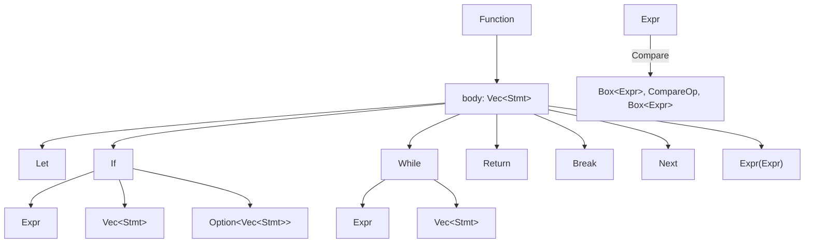
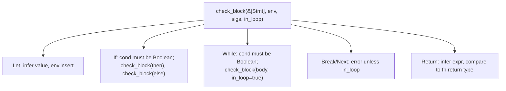
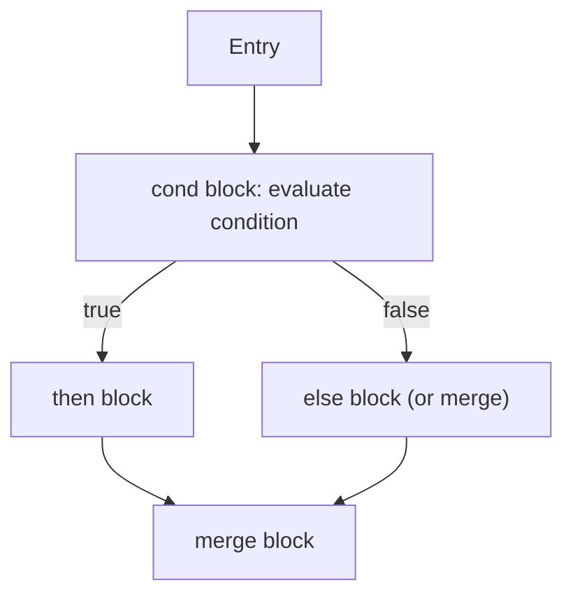
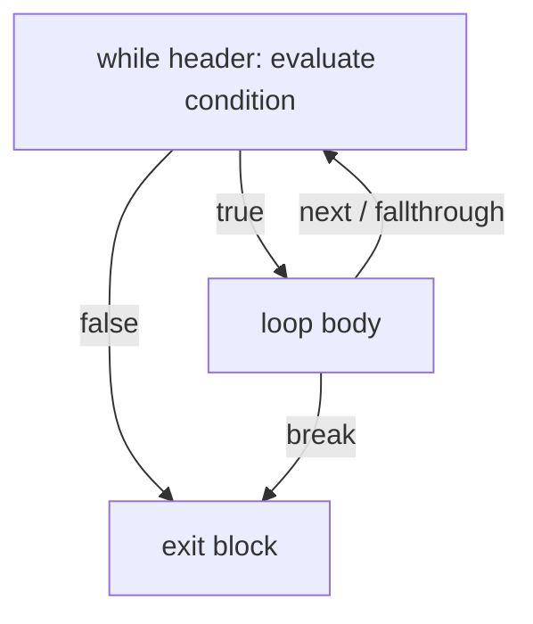

2026-09-08T18:28:49Z

Snapshot of `.cursor/plans/control-flow.plan.md` — plan `07 control-flow`
from [`plan-of-plans`](./2026-09-08T174011Z-plan-of-plans.md) — captured
before execution began.

---
name: Control Flow
overview: Locals, if/while, comparisons, return/break/next — restructuring function/program bodies from a single Expr to a real Vec<Stmt> block, matching inception §17's second milestone slice end to end.
maestro:
  mission_id: null
  spec_path: null
  execution_overlay: null
todos:
  - id: leaf-ast-stmt
    content: Stmt enum (Let/If/While/Return/Break/Next/Expr); Function.body and Program top-level become Vec<Stmt>
    status: pending
  - id: leaf-parser-stmt
    content: Grammar for the Stmt block language, resolving the command-call ambiguity by making puts a keyword
    status: pending
  - id: leaf-sema-stmt
    content: Type-check statement blocks with a mutable local-variable environment; Boolean type for comparisons/conditions
    status: pending
  - id: leaf-codegen-stmt
    content: Cranelift Variable-based codegen for locals + real basic-block control flow for if/while/break/next/return
    status: pending
isProject: false
---

# Plan 07 — Control Flow

This is `control-flow`, row `07` of
[`plan-of-plans`](../../history/2026-09-08T174011Z-plan-of-plans.md),
implementing inception §5 and §17's second milestone slice:
```ruby
x: Int64 = 10

if x > 5
  puts x
end
```

## Decision log

- **`case` is deferred, not implemented here.** Plan-of-plans row 07's
  title lists it, but inception §17's own milestone-2 example (quoted
  above) doesn't use it, and pattern-matching grammar is substantial
  enough to deserve dedicated attention when a concrete case/when example
  drives it (matching this project's own established practice of scoping
  to inception's literal examples, not the broadest reading of a row
  title). Loops, comparisons, `return`/`break`/`next`, and `if`/`else` are
  fully implemented — the row's core intent ships.
- **`puts` becomes a grammar keyword**, not a generic identifier. A
  general `Ident followed-by-Expr` command-call rule and a general
  `Expr-as-statement` rule are genuinely LALR(1)-ambiguous when both start
  with a bare `Ident` (two consecutive identifiers can't be disambiguated
  with 1-token lookahead without more grammar structure than this
  milestone needs). Reserving `puts` as a literal keyword token — the only
  builtin this compiler has — sidesteps the ambiguity entirely. Revisit
  when a second builtin or user-defined command-call syntax is needed.
- **Locals use Cranelift `Variable`, not raw `Value`.** Plan `06`'s
  codegen used raw SSA `Value`s directly since there was no control flow —
  a value computed in one block is not visible in another without SSA
  phi-node plumbing. `Variable` (`declare_var`/`def_var`/`use_var`) is
  Cranelift's standard mechanism for exactly this: a local visible across
  an `if`/`while`'s multiple basic blocks.

## Leaf: leaf-ast-stmt

### 1. Context
- Why: `Function.body: Expr` and `Program`'s top-level `Item::Expr(Expr)`
  can only hold one expression each — locals, `if`, `while`, `return`,
  `break`, `next` are all statements, and a real body is a *sequence* of
  them.
- Current state: `ast.rs` has `Function { body: Expr, .. }` and
  `Item::{Function, Expr}` (verified — read this session in plan 04/06).
- Target state: new `Stmt` enum
  (`Let{name,ty,value}`/`If{cond,then_branch,else_branch}`/
  `While{cond,body}`/`Return(Option<Expr>)`/`Break`/`Next`/`Expr(Expr)`);
  `Function.body: Vec<Stmt>`; `Item::Stmt(Stmt)` replaces `Item::Expr`
  (subsumes it — `Stmt::Expr` covers the old case). `Expr` gains
  `Compare(Box<Expr>, CompareOp, Box<Expr>)` and a `CompareOp` enum
  (`Lt`/`Gt`/`Le`/`Ge`/`Eq`/`Ne`).
- Dependencies: none.
- Maestro: intended slug `leaf-ast-stmt`, wave 0.

### 2. Acceptance Criteria
1. `Stmt` and `CompareOp` exist as described; `Function.body` is
   `Vec<Stmt>`; `Item::Stmt(Stmt)` replaces `Item::Expr(Expr)`.
2. Every call site across `emerald-parser`, `emerald-sema`,
   `emerald-codegen`, `emerald-cli` that matched the old shapes is updated
   to compile against the new ones (breaking change, deliberately — no
   back-compat shim for a pre-1.0, single-consumer AST).

### 3. File & Module Structure
- **Modify:** `crates/emerald-parser/src/ast.rs`

### 4. Diagrams


### 5. Quality Gates
| Gate | Command | Pass | Witness level |
|------|---------|------|---------------|
| Build (whole workspace) | `cargo build --workspace` | exit 0 after all leaves land | agent-claimed-locally |

### 6. Implementation Notes
- This leaf alone will not compile the workspace (parser/sema/codegen
  still reference the old shapes) — it's landed together with
  `leaf-parser-stmt` in one commit, same as plan 04's practice of grouping
  tightly-coupled leaves.

### 7. Risks & Rollback
- Breaking AST change — but the AST has exactly one consumer chain
  (`emerald-parser` → `emerald-sema`/`emerald-codegen` → `emerald-cli`),
  all in this workspace, all updated together.

---

## Leaf: leaf-parser-stmt

### 1. Context
- Why: the grammar needs a real statement/block language instead of the
  single-`BodyExpr` and single-`TopStmt` shapes plan `04` built.
- Current state: `grammar.lalrpop`'s `BodyExpr`/`TopStmt` each parse
  exactly one shape (verified this session).
- Target state: `Stmt*` blocks usable both as a function body and as the
  program's top level, parsing inception §17's milestone-2 example
  end to end.
- Dependencies: `leaf-ast-stmt`.
- Maestro: intended slug `leaf-parser-stmt`, wave 0, paired with
  `leaf-ast-stmt`.

### 2. Acceptance Criteria
1. `emerald_parser::parse` on the milestone-2 example (`x: Int64 = 10 \n
   if x > 5 \n puts x \n end`) succeeds and produces `Item::Stmt(Let)`,
   `Item::Stmt(If { .. })` in order.
2. `examples/hello.em` (milestone-1) still parses identically in
   structure (now via `Stmt::Expr(Expr::Call(...))` instead of the old
   `Item::Expr` — same semantic content, new wrapper).
3. No LALRPOP build-time conflicts (same bar as plan `04` AC2).
4. `while`, `return`, `break`, `next` all parse (each gets at least one
   test).

### 3. File & Module Structure
- **Modify:** `crates/emerald-parser/src/grammar.lalrpop`,
  `crates/emerald-parser/src/lib.rs` (tests)

### 4. Diagrams
Not applicable — grammar-level change, covered by leaf-ast-stmt's diagram.

### 5. Quality Gates
| Gate | Command | Pass | Witness level |
|------|---------|------|---------------|
| Build (no conflicts) | `cargo build -p emerald-parser` | clean, no conflict output | agent-claimed-locally |
| Test | `cargo test -p emerald-parser` | all pass | agent-claimed-locally |

### 6. Implementation Notes
- Comparison operators sit at one precedence level above addition
  (`AddExpr CompareOp AddExpr`, non-associative — chained comparisons like
  `a > b > c` are not supported, matching most languages' actual
  disambiguation and avoiding a real grammar-precedence rabbit hole for a
  feature inception's examples never use).

### 7. Risks & Rollback
- None beyond what plan `04`'s Risks section already covers for grammar
  scope-narrowing.

---

## Leaf: leaf-sema-stmt

### 1. Context
- Why: `check_program`/`check_function_body` currently type-check one
  `Expr`; they need to type-check a `Vec<Stmt>` block with a *mutable*
  environment (each `Let` extends scope for subsequent statements) and a
  new `Boolean` type for comparison results and `if`/`while` conditions.
- Current state: `emerald-sema` has no statement-level checking, no
  `Type::Boolean` (verified — read in plan 05).
- Target state: `Type::Boolean` added; a block-checking function that
  processes `Stmt`s in order, threading a mutable `HashMap<String, Type>`
  environment; `if`/`while` conditions must type-check to `Boolean`
  (locks `spec/GRAMMAR.md` §5's "no truthy/falsy coercion" rule);
  `break`/`next` outside any loop is a diagnostic, not a panic; a
  function's implicit return value is its last statement's expression
  type when that statement is `Stmt::Expr`, or the `Return`'s expression
  type when control provably ends in `return`.
- Dependencies: `leaf-ast-stmt`.
- Maestro: intended slug `leaf-sema-stmt`, wave 1, blocked by
  `leaf-ast-stmt`.

### 2. Acceptance Criteria
1. `Type::Boolean` exists; `Expr::Compare` infers to `Boolean` when both
   operands are the same comparable type, else a diagnostic naming both
   types (same style as plan 05's `Add` mismatch diagnostic).
2. `if`/`while` with a non-`Boolean` condition (e.g. `if 5 ... end`) is
   rejected with a diagnostic — not silently truthy-coerced (locks
   `spec/SEMANTICS.md` §1's condition-typing rule).
3. The milestone-2 example type-checks `Ok(())`.
4. `break`/`next` outside a loop body produces a diagnostic, not a panic.
5. A `Let` re-declaring an already-bound name in the same block is
   accepted as reassignment when the type matches (locks
   `spec/SEMANTICS.md` §1: "variables cannot change type after
   initialization") and rejected with a diagnostic when the type differs.

### 3. File & Module Structure
- **Modify:** `crates/emerald-sema/src/lib.rs`

### 4. Diagrams


### 5. Quality Gates
| Gate | Command | Pass | Witness level |
|------|---------|------|---------------|
| Test | `cargo test -p emerald-sema` | all pass | agent-claimed-locally |

### 6. Implementation Notes
- `check_block` takes an `in_loop: bool` threaded down (not up) so
  `break`/`next` inside a nested `if` within a `while` are still legal,
  but `break`/`next` inside a function body with no enclosing `while` are
  rejected.

### 7. Risks & Rollback
- None — additive checking logic over the new AST shape.

---

## Leaf: leaf-codegen-stmt

### 1. Context
- Why: `emerald-codegen`'s `build_expr`/`define_user_function` only
  handle a single expression with no branching; `if`/`while` need real
  Cranelift basic blocks, and locals need `Variable`s visible across them.
- Current state: `define_user_function` builds one basic block with no
  branches (verified in plan 06).
- Target state: a statement-block codegen function using
  `declare_var`/`def_var`/`use_var` for locals and params, real
  `if`/`while` block wiring (`brif`, `jump`, `seal_block`), a loop-target
  stack for `break`/`next`, and `return_` for `Stmt::Return`.
- Dependencies: `leaf-sema-stmt` (codegen only ever runs on
  already-checked input, same contract as plan 06).
- Maestro: intended slug `leaf-codegen-stmt`, wave 1, blocked by
  `leaf-sema-stmt`.

### 2. Acceptance Criteria
1. `compile_to_object` on the milestone-2 example produces an object file
   whose linked-and-run executable prints `10\n` (per `x: Int64 = 10; if
   x > 5; puts x; end` — `10 > 5` is true, so `x` prints).
2. A `while` loop summing `1..=3` into a local and printing it via `puts`
   produces `6\n` when run — proving real loop codegen, not just `if`.
3. `break` inside that loop, triggered by a condition, correctly exits
   early — tested by a variant that would print a different sum if
   `break` didn't work.
4. Unsupported statement shapes (defensive — sema should already reject
   anything codegen can't handle) return a descriptive `Err`, not a panic
   or a miscompile, matching plan 06's leaf-codegen-from-ast AC4 standard.

### 3. File & Module Structure
- **Modify:** `crates/emerald-codegen/src/lib.rs`

### 4. Diagrams



### 5. Quality Gates
| Gate | Command | Pass | Witness level |
|------|---------|------|---------------|
| Test | `cargo test -p emerald-codegen` | all pass, incl. real linked-and-run assertions | agent-claimed-locally |
| Workspace | `cargo test --workspace` | all pass | agent-claimed-locally |

### 6. Implementation Notes
- `emerald-codegen`'s own tests can link+run directly (same pattern
  `emerald-cli`'s tests use — invoke `cc`, run the binary, assert stdout)
  rather than routing every control-flow proof through `emerald-cli`,
  since these are codegen-level correctness proofs, not CLI-level ones.

### 7. Risks & Rollback
- Risk: incorrect `seal_block` ordering is a classic Cranelift footgun
  (a block must be sealed only once all its predecessors are known,
  otherwise `use_var` can't resolve phi nodes correctly). Mitigated by
  following the documented if/while patterns from Cranelift's own
  reference examples precisely, and by AC1–3 being real executable
  proofs, not just "it compiles."

## Total quality gate
```bash
cargo build --workspace
cargo test --workspace
```

## Out of scope / deferred
- `case`/`when` — see Decision log.
- `for ... in` iteration (needs `Array[T]`/`Range[T]` from `09
  collections`, not yet built).
- General command-call syntax beyond the `puts` keyword — see Decision log.
- Reassignment codegen for locals whose *value* changes after `Let`
  (`x = x + 1`) — this milestone's examples only need single-assignment
  locals inside straight-line and loop bodies; SEMANTICS.md already
  permits reassignment, `Stmt::Let` reuse for the same name covers it at
  the sema layer, and Cranelift `Variable`s support `def_var` being called
  more than once — so this is not a hard blocker, but no test exercises it
  yet and it is not claimed as proven.
