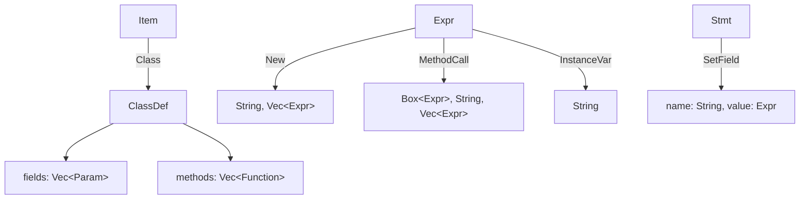
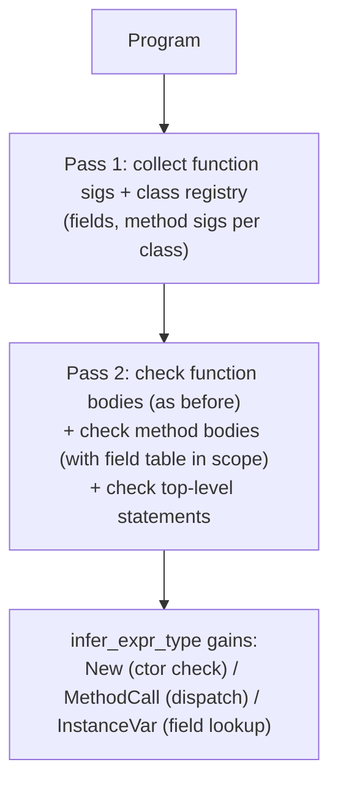
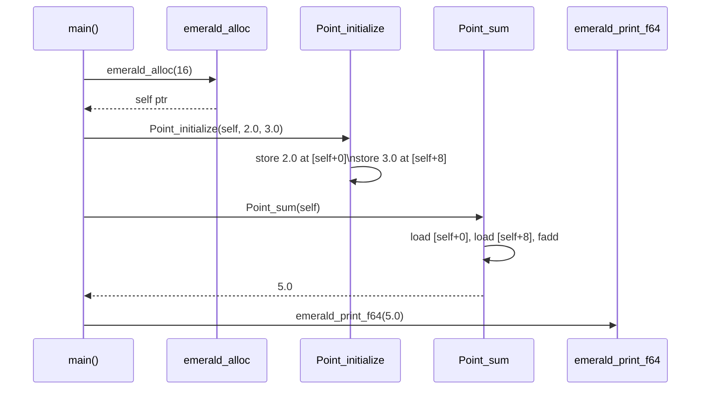

2026-09-08T18:42:45Z

Snapshot of `.cursor/plans/object-model.plan.md` — plan `08 object-model`
from [`plan-of-plans`](./2026-09-08T174011Z-plan-of-plans.md) — captured
before execution began.

---
name: Object Model
overview: Classes, declared fields, initialize, static method dispatch, .new construction — inception §17's third milestone slice (the Point example) end to end, including the Float64 support it requires.
maestro:
  mission_id: null
  spec_path: null
  execution_overlay: null
todos:
  - id: leaf-ast-class
    content: ClassDef/Item::Class; Expr::{Float, New, MethodCall, InstanceVar}; Stmt::SetField
    status: pending
  - id: leaf-parser-class
    content: Grammar for class bodies, field decls, .new, receiver.method calls, @field reads, float literals
    status: pending
  - id: leaf-sema-class
    content: Type::Class(String) + a class registry threaded through the checker; field/method type-checking
    status: pending
  - id: leaf-codegen-class
    content: Struct layout via a runtime allocator, self-pointer method codegen, field load/store, type-aware puts dispatch
    status: pending
isProject: false
---

# Plan 08 — Object Model

This is `object-model`, row `08` of
[`plan-of-plans`](../../history/2026-09-08T174011Z-plan-of-plans.md),
implementing inception §8 and §17's third milestone slice:
```ruby
class Point
  x: Float64
  y: Float64

  def initialize(x: Float64, y: Float64) -> Void
    @x = x
    @y = y
  end

  def sum -> Float64
    @x + @y
  end
end

p = Point.new(2.0, 3.0)
puts p.sum
```

## Decision log

- **Inheritance is deferred, not implemented here** despite plan-of-plans
  row 08's title — the `Point` example inception actually gives has no
  superclass, and single-inheritance dispatch is a distinct, separable
  chunk of work (vtables or static-only resolution over an ancestor
  chain) better scoped to its own future increment when a concrete
  multi-class example needs it. `object-model` here means "one class, its
  fields, its methods, its constructor" — matching what the example
  proves, same practice as `07`'s `case` deferral.
- **`puts` stays a single intrinsic, not an overloaded function** —
  `spec/SEMANTICS.md` §3 locks "no overloading in v1." `sum` returns
  `Float64`; `add` (plan `06`) returns `Int64`; both go through `puts`.
  Rather than giving `puts` two signatures (which would be overloading) or
  inventing a union/dynamic type, `emerald-codegen` inspects the *actual
  Cranelift value type* of the generated argument (`F64` vs `I64`) after
  building it, and dispatches to `emerald_print_f64` or `emerald_print_i64`
  accordingly. `puts` is a compiler intrinsic with call-site-polymorphic
  codegen, not a user-overloadable method — the two are different things.
- **New instances are heap-allocated via a runtime allocator
  (`emerald_alloc`, thin `malloc` wrapper in the C runtime shim)** — same
  ABI-safety rationale as plan `06`'s `emerald_print_i64`: calling libc's
  `malloc` with the right calling convention is handled by real C, not
  risked in Cranelift-generated code. No GC — matches inception §12 (no
  ownership system, no GC pressure yet); freeing is not implemented and
  not needed for this milestone's straight-line example.
- **Field layout is naive: every field takes 8 bytes, offset by
  declaration order**, regardless of declared type. `Int64`/`Float64`/a
  pointer to another instance are all 8 bytes on the x86-64 target this
  session builds for, so this is not actually a hack for the types this
  milestone has (`Float64` only) — it becomes a real simplification worth
  revisiting once a field type narrower than 8 bytes exists.
- **`new` becomes a reserved keyword**, alongside `puts`, for the same
  LALR(1) reason plan `07` reserved `puts`: `recv.new(args)` needs `new`
  to be lexically distinct from a general method name so the grammar can
  commit to the constructor-call shape unambiguously.

## Leaf: leaf-ast-class

### 1. Context
- Why: no AST shape exists for a class, a field, an instance-variable
  read/write, a constructor call, or a method call on a receiver.
- Current state: `ast.rs` has `Function`/`Stmt`/`Expr` from plan `07`, no
  class-related types (verified this session).
- Target state: `ClassDef { name: String, fields: Vec<Param>, methods:
  Vec<Function> }` (fields reuse `Param`'s `{name, ty}` shape — a field
  declaration and a parameter declaration are structurally identical);
  `Item::Class(ClassDef)`; `Expr` gains `Float(f64)`,
  `New(String, Vec<Expr>)`, `MethodCall(Box<Expr>, String, Vec<Expr>)`,
  `InstanceVar(String)`; `Stmt` gains `SetField { name: String, value:
  Expr }` (for `@x = x` — no type annotation, unlike `Let`, since the
  field's type is already declared on the class).
- Dependencies: none.
- Maestro: intended slug `leaf-ast-class`, wave 0.

### 2. Acceptance Criteria
1. All types/variants above exist exactly as described.
2. Existing `Function`/`Stmt`/`Expr` variants and their consumers remain
   source-compatible (additive change, matching plan `07`'s leaf-ast-stmt
   practice).

### 3. File & Module Structure
- **Modify:** `crates/emerald-parser/src/ast.rs`

### 4. Diagrams


### 5. Quality Gates
| Gate | Command | Pass | Witness level |
|------|---------|------|---------------|
| Build (whole workspace, after all leaves land) | `cargo build --workspace` | exit 0 | agent-claimed-locally |

### 6. Implementation Notes
- Landed together with `leaf-parser-class` in one commit, same practice as
  plan `07`'s tightly-coupled AST+grammar leaves.

### 7. Risks & Rollback
- Breaking AST change confined to this workspace's single consumer chain.

---

## Leaf: leaf-parser-class

### 1. Context
- Why: the grammar needs `class ... end` bodies, `@field` reads,
  `receiver.method`/`receiver.new(args)` calls, and float literals.
- Current state: `grammar.lalrpop` has no class/instance-var/method-call
  productions and no float-literal token (verified this session).
- Target state: parses the full `Point` example end to end, including the
  `p = Point.new(2.0, 3.0)` / `puts p.sum` tail.
- Dependencies: `leaf-ast-class`.
- Maestro: intended slug `leaf-parser-class`, wave 0, paired with
  `leaf-ast-class`.

### 2. Acceptance Criteria
1. The full `Point` example (class body + trailing two statements) parses
   into the expected `ClassDef`/`Stmt`/`Expr` shapes.
2. `@x = x` parses as `Stmt::SetField`; `@x + @y` parses with both sides as
   `Expr::InstanceVar`.
3. `Point.new(2.0, 3.0)` parses as `Expr::New("Point", [Float(2.0),
   Float(3.0)])`; `p.sum` parses as `Expr::MethodCall(Ident("p"), "sum",
   [])`.
4. No LALRPOP build-time conflicts (same bar as plans `04`/`07`).
5. Regression: `examples/hello.em` and plan `07`'s milestone-2 example
   still parse identically.

### 3. File & Module Structure
- **Modify:** `crates/emerald-parser/src/grammar.lalrpop`,
  `crates/emerald-parser/src/lib.rs` (tests)

### 4. Diagrams
Not applicable — grammar-level change, covered by leaf-ast-class's diagram.

### 5. Quality Gates
| Gate | Command | Pass | Witness level |
|------|---------|------|---------------|
| Build (no conflicts) | `cargo build -p emerald-parser` | clean | agent-claimed-locally |
| Test | `cargo test -p emerald-parser` | all pass | agent-claimed-locally |

### 6. Implementation Notes
- `receiver.method(args)` (parenthesized args on a method call) is **not**
  added — `sum` takes none, and adding it now is unexercised generality.
  `receiver.method` (bare, zero-arg) is all this plan needs.
- Float literal regex: `[0-9]+\.[0-9]+` — no exponent notation, no
  bare-trailing-dot forms. Matches only what `2.0`/`3.0` need.

### 7. Risks & Rollback
- None beyond the established narrow-grammar-scope risk plans `04`/`07`
  already accepted.

---

## Leaf: leaf-sema-class

### 1. Context
- Why: `check_program` has no concept of a class, so it can't resolve
  `Point.new(...)`'s constructor signature, `p.sum`'s method signature, or
  `@x`/`@y`'s field types.
- Current state: `Type` has no reference-type variant; `check_program`
  only walks `Item::Function`/`Item::Stmt` (verified in plan `07`).
- Target state: `Type::Class(String)`; a class registry
  (`HashMap<String, ClassInfo>` — fields as `HashMap<String, Type>`,
  methods as `HashMap<String, FunctionSig>`) built in a first pass
  alongside the existing function-signature pass; `resolve_type` (renamed
  from `resolve_type_name`, now checking the class registry after
  primitives) used everywhere a type name is resolved; method bodies
  type-check `Stmt::SetField`/`Expr::InstanceVar` against the enclosing
  class's field table.
- Dependencies: `leaf-ast-class`.
- Maestro: intended slug `leaf-sema-class`, wave 1, blocked by
  `leaf-ast-class`.

### 2. Acceptance Criteria
1. `check_program` on the full `Point` example returns `Ok(())`.
2. `Expr::New("Point", args)` type-checks `args` against `initialize`'s
   parameter types (arity + type, same rule as any other call) and infers
   type `Type::Class("Point")`.
3. `Expr::MethodCall` requires the receiver to infer to `Type::Class(_)`;
   resolves the method by name against that class's method table (name +
   receiver type + arity, per `spec/SEMANTICS.md` §3); a call to an
   undeclared method, or a method call on a non-class receiver, is a
   diagnostic, not a panic.
4. `Stmt::SetField`/`Expr::InstanceVar` outside any method body is a
   diagnostic (there is no `self` to resolve against), not a panic.
5. Assigning a field with the wrong type (e.g. `@x = "hello"` where `x:
   Float64`) is rejected with a diagnostic naming both types, same
   standard as plan `05`'s `Int64`/`String` mismatch.

### 3. File & Module Structure
- **Modify:** `crates/emerald-sema/src/lib.rs`

### 4. Diagrams


### 5. Quality Gates
| Gate | Command | Pass | Witness level |
|------|---------|------|---------------|
| Test | `cargo test -p emerald-sema` | all pass | agent-claimed-locally |

### 6. Implementation Notes
- Method bodies are checked with a *separate* entry point from plain
  function bodies (`check_method_body(class, method, registry)`) since
  they need the field table in scope that free functions don't have —
  cleaner than threading an `Option<&ClassInfo>` through every function
  body check.

### 7. Risks & Rollback
- None — additive checking logic over the new AST shapes.

---

## Leaf: leaf-codegen-class

### 1. Context
- Why: nothing compiles a class to machine code yet — no allocation, no
  field storage, no method dispatch.
- Current state: `emerald-codegen` only handles `Item::Function`/
  `Item::Stmt` (verified in plan `07`).
- Target state: each class method compiles to a name-mangled function
  (`Point_initialize`, `Point_sum`) taking an implicit leading `self:
  i64`-typed pointer parameter; `Expr::New` compiles to a call to
  `emerald_alloc(field_count * 8)` followed by a call to the class's
  `initialize`; `Stmt::SetField`/`Expr::InstanceVar` compile to
  `store`/`load` at `self + field_offset`; `Expr::MethodCall` compiles to
  a direct static call `ClassName_method(receiver_value, args...)`; `puts`
  dispatches to `emerald_print_i64` or the new `emerald_print_f64` based
  on the built argument `Value`'s actual Cranelift type (`I64` vs `F64`),
  not a separately-tracked type system (see Decision log).
- Dependencies: `leaf-sema-class` (codegen runs on already-checked input,
  same contract as every prior codegen plan).
- Maestro: intended slug `leaf-codegen-class`, wave 1, blocked by
  `leaf-sema-class`.

### 2. Acceptance Criteria
1. The full `Point` example, compiled, linked, and run, prints `5\n` (or
   whatever exact textual form `emerald_print_f64` produces for `5.0` —
   pin the exact expected string in the test once written, don't guess it
   here) — this is inception §17's third milestone's own acceptance bar,
   executed for real.
2. `runtime/emerald_runtime.c` gains `emerald_alloc(long long) -> void*`
   (thin `malloc` wrapper) and `emerald_print_f64(double) -> void`.
3. `Expr::Add` codegen dispatches to `fadd` when operands are `F64`-typed
   Cranelift values, `iadd` otherwise — proven by `sum`'s `@x + @y`
   (`Float64 + Float64`) still working alongside `add`'s existing
   `Int64 + Int64` path (plan `06`, unchanged).
4. Calling a method on the wrong argument count, or any other
   already-sema-rejected shape reaching codegen directly (defensive,
   mirroring plan `06`'s AC4 standard), returns a descriptive `Err`, not a
   panic.

### 3. File & Module Structure
- **Modify:** `crates/emerald-codegen/src/lib.rs`,
  `runtime/emerald_runtime.c`

### 4. Diagrams


### 5. Quality Gates
| Gate | Command | Pass | Witness level |
|------|---------|------|---------------|
| Test | `cargo test -p emerald-codegen` | all pass, incl. real linked-and-run Point proof | agent-claimed-locally |
| Workspace | `cargo test --workspace` | all pass | agent-claimed-locally |

### 6. Implementation Notes
- Name-mangling scheme: `{ClassName}_{methodName}` — simple, sufficient
  while there's no overloading and no nested/generic types to collide on.
- `emerald_alloc` deliberately never frees — matches the Decision log; not
  a leak *fix* deferred, a lifetime-management *feature* deferred.

### 7. Risks & Rollback
- Risk: `malloc`'s return value is untyped (`void*`); Cranelift treats it
  as a plain `i64` pointer value throughout — consistent with the
  "everything is 8 bytes" field-layout simplification, not a new risk.

## Total quality gate
```bash
cargo build --workspace
cargo test --workspace
```

## Out of scope / deferred
- Inheritance, `struct` (value-type classes), multiple classes calling
  each other's methods, `self` as an explicit expression a method body can
  reference directly (only `@field` access is proven) — see Decision log
  and `spec/TYPE_SYSTEM.md` §5's `struct` note.
- Deallocation / any memory-management story beyond "allocate and leak."
- `receiver.method(args)` (parenthesized, non-empty argument method
  calls) — only `receiver.method` (bare) is proven.
- Modules (`08` doesn't touch `spec/SEMANTICS.md` §10's namespace-only
  decision at all).
