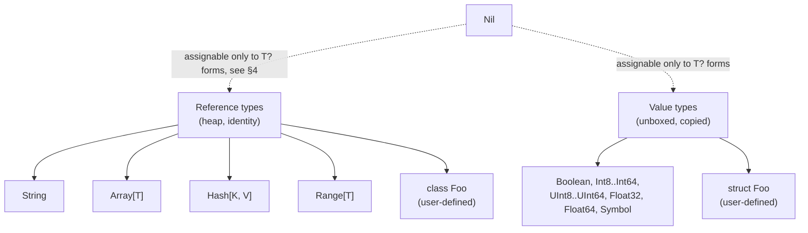

# Emerald — TYPE_SYSTEM.md

**Status:** v1 type universe
**Governing question (inception §9, §2.2):** what is the smallest
modification to Ruby's object model that gives static types without
importing another language's type system wholesale?

---

## 1. Kinds of types

Emerald v1 has three kinds of types:

| Kind | Examples | Representation |
|---|---|---|
| Value types | `Boolean`, `Int8`..`Int64`, `UInt8`..`UInt64`, `Float32`, `Float64`, `Symbol` | Unboxed; no allocation, no identity, compared by value. |
| Reference types | `String`, `Array[T]`, `Hash[K, V]`, `Range[T]`, `class` instances | Heap-allocated, compared by reference unless the type defines `==`. |
| `struct` types | user-defined `struct Foo` | Value semantics (copied, unboxed when small) — see §5. |

This mirrors inception §12: no ownership/borrow system, a conventional
managed runtime for reference types, unboxed primitive/value operations.

---

## 2. Primitive types

| Type | Size | Notes |
|---|---|---|
| `Boolean` | 1 byte | `true` / `false` only. No truthy/falsy coercion of other types (locks `SEMANTICS.md` §1's condition-typing rule). |
| `Int8`, `Int16`, `Int32`, `Int64` | 1/2/4/8 bytes | Signed, two's complement, wraps on overflow in v1 (no built-in checked-arithmetic surface yet — see §7). |
| `UInt8`, `UInt16`, `UInt32`, `UInt64` | 1/2/4/8 bytes | Unsigned counterparts. |
| `Float32`, `Float64` | 4/8 bytes | IEEE 754. |
| `String` | — | UTF-8, reference type — see §6. |
| `Symbol` | — | Interned, value type; two symbols with equal name are `==` in O(1) via identity of the interned entry. |
| `Nil` | — | Single value `nil`; see §4. |
| `Void` | — | Only legal as a method return type; not a value any expression can produce. |
| `Integer` | — | **Not a primitive alias.** See §3 — this is the one question inception §7 explicitly flags as undecided, and it is resolved here, not left implicit. |

---

## 3. The `Integer` decision

Inception §7 asks explicitly: is Emerald's `Integer` arbitrary-precision
(Ruby's actual behavior) or a machine-integer alias, and warns not to let
this be decided "accidentally through the implementation."

**Decision: `Integer` does not exist as a builtin name in v1.** An
unannotated integer literal (`42`) has static type `Int64` — the default
width chosen to match native machine word size on the target platforms
inception §21 lists (matches inception §7's own "likely initial choice").
There is no arbitrary-precision integer type in v1 at all, named or
otherwise.

**Rationale:**
- Inception §11's numeric-performance goal is a primary motivation for the
  whole project; arbitrary precision requires a boxed representation or a
  runtime big-integer fallback path on overflow, which reintroduces exactly
  the dynamic-dispatch/boxing cost inception §11 lists as things the
  compiler must avoid.
- Inception §2.2's governing question favors the smallest modification:
  Ruby programmers who write bare integer literals get native `Int64`
  arithmetic by default, matching the common case, without the compiler
  silently making a big-vs-machine-int choice per operation the way CRuby
  does.
- If arbitrary precision proves necessary later (e.g. for a stdlib
  `BigInt`), inception §2.3's own rule applies: it is a deliberate,
  explicitly reintroduced feature — a named reference type (`BigInt`, not
  `Integer`), not a silent default.

**Consequence:** `spec/GRAMMAR.md` §1's "Integer literals" row types bare
literals as `Int64` per this decision — the grammar entry does not restate
the question.

---

## 4. Nil and nullable types

**Superseded by the Sable-alignment grammar cutover (plan 73) — kept
below as the historical record of the v1 design, not current syntax.**
`T?`/`nil`/`&.`/`||=` are removed outright, not kept alongside a
replacement: `Option[T]` is now a real generic ADT (`Some(T)`/`None`,
plan 52's enum/pattern-matching mechanism extended to accept a type
parameter — the project's first generic enum), with `?.`/`??` as sugar
over `Option[T]` pattern matching rather than a pointer-nullness check.
`nil`'s old `i64`-zero sentinel is gone from codegen entirely. See
`history/2026-09-19T112000Z-plan-73-option-type-and-nullability-
replacement.md` for the full design and decision log. The section below
describes what came before, unedited, for historical accuracy — do not
treat it as current.

- `Nil` is a real type with exactly one value, `nil`.
- A plain type name (`Int64`, `String`, `Point`) is **not** nil-assignable.
  `x: Int64 = nil` is a compile error.
- A **nullable type** is written `T?` (e.g. `String?`, `Point?`) and is the
  union of `T` and `Nil`. This is the one new type-syntax form v1 adds
  beyond the annotation syntax `GRAMMAR.md` already introduces.
- Safe navigation (`&.`, `GRAMMAR.md` §4) is legal only on a `T?` receiver
  and produces a `U?` result from a method returning `U`.
- Reference types default to non-nullable; there is no implicit `null`
  the way Java/Kotlin-without-strict-null-checks have. This is the
  "smallest modification" answer to inception §19's nil questions, and
  the single locked assumption `SEMANTICS.md` §2 builds on.

---

## 5. User-defined types

- `class Foo` — reference type. Fields are declared in the class body with
  explicit type annotations (`GRAMMAR.md` §8); an undeclared `@foo` access
  is a compile error, not a dynamically created instance variable.
- `struct Foo` — value type. Same field-declaration syntax as `class`;
  assignment and parameter passing copy the value rather than share a
  reference. Intended for small, immutable-by-convention data (a
  statically-typed analogue of Ruby's `Struct.new`, without the dynamic
  metaprogramming that generates it in Ruby).
- Both support single inheritance (`class`) — `struct` does not support
  inheritance in v1 (matches inception §8's "no multiple inheritance"
  spirit; single-inheritance value types with an ancestor chain add
  layout/dispatch complexity inception §22 rule 9 warns against for no
  clear v1 use case).

---

## 6. Literal typing

| Literal form | Static type |
|---|---|
| `42`, `0x2a`, `0b101010` | `Int64` (see §3) |
| `3.14`, `1e10` | `Float64` |
| `"..."` | `String` |
| `:foo` | `Symbol` |
| `[1, 2, 3]` | `Array[T]` where `T` is the unified element type (compile error if elements don't unify) |
| `{a: 1}` | `Hash[Symbol, T]` where `T` is the unified value type |
| `true` / `false` | `Boolean` |
| `nil` | `Nil` |
| `1..10` | `Range[T]` where `T` is the unified endpoint type |

An explicit annotation narrows/widens where the literal's inferred type
isn't the desired one, e.g. `x: Int32 = 42` narrows the `Int64`-by-default
literal to `Int32` at the declaration site (see §7 for the legality of
that narrowing).

---

## 7. Numeric conversions

- **Implicit (widening only):** `Int8 → Int16 → Int32 → Int64`,
  `UInt8 → UInt16 → UInt32 → UInt64`, `Float32 → Float64`,
  and any signed/unsigned integer type of width *W* `→ Float64` when *W* ≤
  32 (narrower integers always fit exactly in a `Float64` mantissa;
  `Int64`/`UInt64` do not, so that conversion requires an explicit cast).
- **Explicit only (no implicit conversion):**
  - Narrowing integer conversions (`Int64 → Int32`, etc.) — possible
    truncation.
  - Signed ↔ unsigned conversions at the same width (`Int32 ↔ UInt32`) —
    possible reinterpretation of the sign bit.
  - Float → integer conversions — possible truncation/precision loss.
  - `Int64`/`UInt64` → `Float64` — possible precision loss (see above).
- **Mixed-type arithmetic** (`Int32 + Int64`, etc.) is a compile error
  unless one operand implicitly widens to the other's type per the rules
  above; there is no silent Ruby-style promotion to the "bigger" type.
- Explicit conversions use a cast call, e.g. `x.to_i32`, `x.to_f64` — exact
  cast-method naming is deferred to `RUNTIME.md`/`COMPILER.md` (out of scope
  for this plan; see plan-of-plans row `02`).

This directly satisfies inception §11's numeric-performance goal: ordinary
integer arithmetic within one width compiles to a single machine
instruction, with no runtime type check or box unwrap on the hot path.

---

## 8. Collections

- `Array[T]` — homogeneous, statically parameterized (inception §10).
  **Representation requirement, not just permission:** for any `T` that is
  a value type (§1), `Array[T]` must have an unboxed/packed contiguous
  storage path — e.g. `Array[Int64]` is backed by a contiguous `Int64`
  buffer, not an array of boxed references. `Array[T]` for a reference
  type `T` stores references contiguously (still no per-element boxing
  beyond the reference itself). This is inception §10's explicit example
  and §11's numeric-performance requirement, stated here as a hard
  representation constraint rather than an implementation detail left
  unspecified.
- `Hash[K, V]` — statically parameterized key/value map. No representation
  constraint as strict as `Array[T]`'s in v1 (hashing/bucket layout is a
  `RUNTIME.md` concern); `K` must support a static `hash`/`==` pair.
- `Range[T]` — endpoints of type `T`; iterable when `T` supports a
  successor operation.
- Mutability: `Array[T]` and `Hash[K, V]` are mutable reference types
  (Ruby's default); an immutable/frozen variant is not introduced in v1
  (not in inception §5's keep list; would need its own grammar surface).

---

## 9. Strings

- `String` is UTF-8 encoded, matching inception §19's Strings question.
- Reference type (§1), mutable in v1 — matches Ruby's default and avoids
  introducing a second `MutableString`/`String` split before there's a
  concrete need (inception §2.2's minimal-modification principle).
- Byte-level access (for when a program genuinely wants raw bytes, not
  Unicode scalar values) goes through an explicit conversion, not through
  `String` itself pretending to be a byte array.

---

## 10. Assignability summary

| From \ To | `T` (non-null) | `T?` |
|---|---|---|
| value of type `T` | ✓ | ✓ (widens) |
| `nil` | ✗ (compile error) | ✓ |
| value of a `T` subtype (class) | ✓ | ✓ |
| value of an unrelated type `U` | ✗ | ✗ |

No implicit "same shape, different type" structural assignability — matches
`GRAMMAR.md`'s no-duck-typing stance (inception §9) and `SEMANTICS.md` §1.

---

## Cross-references

- Grammar forms for these types (`T?`, `Array[T]`, class/struct field
  syntax) are defined in [`GRAMMAR.md`](./GRAMMAR.md).
- Variable mutability, method-resolution, and per-domain semantic
  decisions that *use* these types are in [`SEMANTICS.md`](./SEMANTICS.md).
